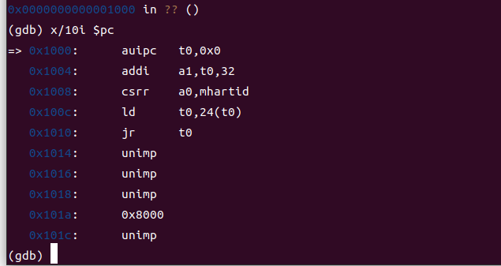
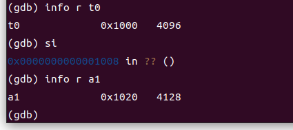
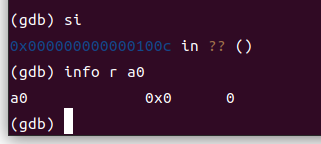
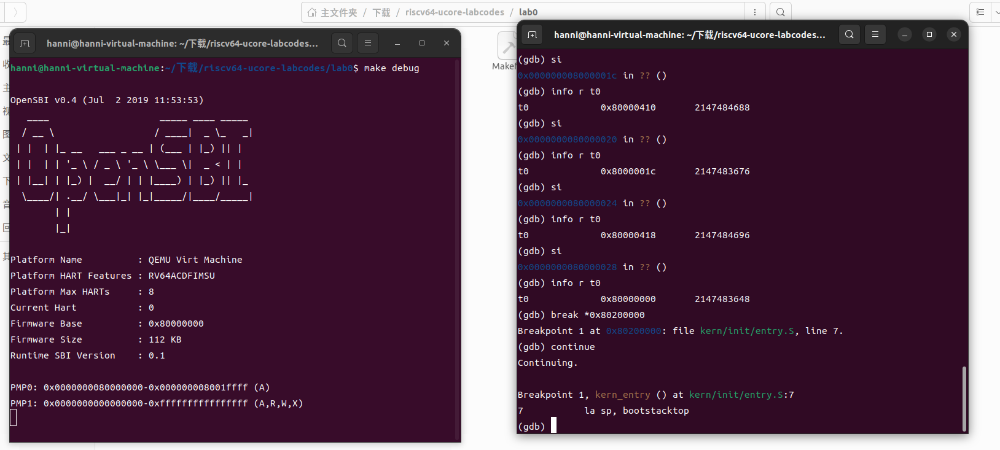

# 操作系统第一次实验报告
## Lab 0.5 实验报告
### 练习1: 使用GDB验证启动流程

`问题： 为了熟悉使用qemu和gdb进行调试工作,使用gdb调试QEMU模拟的RISC-V计算机加电开始运行到执行应用程序的第一条指令（即跳转到0x80200000）这个阶段的执行过程，说明RISC-V硬件加电后的几条指令在哪里？完成了哪些功能？要求在报告中简要写出练习过程和回答。`

首先，我们在从oslab网站上取得实验代码后，进入目录riscv64-ucore-labcodes/lab0，并在这个目录下同时打开两个终端，我们先输入make debug，然后在另一个终端里输入make gdb。这是为了与qemu配合进行源代码级别的调试，而这需要先让qemu进入等待gdb调试器的接入，并且还不能让qemu中的CPU执行，然后我们再启动gdb，使其连接到qemu。

如图所示：

如上图所示，我们可以看到QEMU模拟的该RISC-V计算机加电开始启动首先停在了0x1000处，**即这款riscv处理器的复位地址是0x1000**（复位地址指的是CPU在上电的时候，或者按下复位键的时候，PC被赋的初始值）。

我们知道，操作系统作为一个程序，必须加载到内存里才能执行。而“**把操作系统加载到内存里**”这件事情是由bootloader完成的.而在QEMU模拟的riscv计算机里，我们使用QEMU自带的bootloader: OpenSBI固件。

在QEMU模拟的这款riscv处理器中，将**复位向量地址初始化为0x1000**，再将PC初始化为该复位地址，因此处理器将从此处开始执行复位代码，复位代码主要是将计算机系统的各个组件（包括处理器、内存、设备等）置于初始状态，并且会启动Bootloader。

**接下来我们用指令x/10i $pc来显示即将执行的10条汇编指令。**
如图所示：

1. `auipc t0, 0x0`
   - auipc将程序计数器（PC）的高20位加上立即数，并将结果存储在目标寄存器 t0 中。这里的立即数是 0x0，所以它只是将当前PC（0x1000）的高20位（即 0x1000）加载到 t0。即t0的值应该为0x1000。如图所示：

2. `addi a1, t0, 32`
   - addi将寄存器 t0 的值加上立即数 32，并将结果存储在寄存器 a1中。即a1的值应该为0x1020。如图所示：

3. `csrr a0, mhartid`
   - csrr指令从控制和状态寄存器 mhartid中读取硬件线程ID（即硬件线程的编号），并将其存储在寄存器 a0中。如图所示：

4. `ld t0, 24(t0)`
   - ld从t0指定的内存地址偏移 24 字节处加载一个64位的值，并将其存储在寄存器 t0 中。 如图所示：

5. `jr t0`
   - jr指令将程序跳转到寄存器t0中存储的地址。执行完这条指令，将跳转到0x80000000处。
6. `unimp`
   - unimp指令表示当前操作未实现。这可能是占位符或保留指令。

9. `0x8000`
   - 这是一个常量数据字，表示一个地址。

**综上，RISC-V硬件加电后的几条指令在地址0x1000处，这几条指令主要是将计算机系统的各个组件（包括处理器、内存、设备等）置于初始状态，并且会让CPU控制流从复位地址0x1000处跳转到OpenSBI加载地址0x80000000从而启动OpenSBI，而接下来OpenSBI将加载操作系统内核并启动操作系统的执行。**

**接下来，我们通过看OpenSBI启动后执行的10条汇编指令简单分析下这几条指令完成了什么功能。**
如图所示：

1. `csrr a6, mhartid`
   - csrr是从控制状态寄存器读取数据的指令，这里从 mhartid寄存器读取当前硬件线程的ID，将其存储在寄存器 a6中。如图所示：

2. `bgtz a6, 0x80000108`
   - bgtz指令检查 a6是否大于 0。如果 a6 > 0，则跳转到地址 0x80000108。因为a6的值不大于0，所以没有发生跳转。
   

3. `auipc t0, 0x0`
   - auipc指令将当前PC的高20位加上立即数0，将结果存储在 t0中。如图所示：
   
   

4. `addi t0, t0, 1032`
   - addi将t0中的值加上立即数1032，并将结果存储在t0中。如图所示：

5. `auipc t1, 0x0`
   - 同样使用auipc指令，将当前PC的高20位加上立即数0，并存储在 t1 中。如图所示：

6. `addi t1, t1, -16`
   - 将 t1中的值加上立即数 -16，结果存储在 t1中。如图所示：
   

7. `sd t1, 0(t0)`
   - sd指令将寄存器t1中的值存储到内存地址 t0（偏移0字节处）。
   

8. `auipc t0, 0x0`
   - 使用 auipc指令再次将当前PC的高20位加上立即数0，并存储在 t0 中。如图所示：

9. `addi t0, t0, 1020`
   - 将 t0中的值加上立即数1020，结果存储在 t0 中。如图所示：

10. `ld t0, 0(t0)`
    - ld指令从内存地址t0（偏移0字节处）加载一个64位的值，并将其存储在寄存器 t0中。

**综上，自从CPU控制流从复位地址0x1000处跳转到OpenSBI加载地址0x80000000从而启动OpenSBI后，这些指令主要用于设置寄存器、获取当前硬件线程的ID。此外，最主要的功能是通过OpenSBI将操作系统的二进制可执行文件加载到内存中，然后OpenSBI会把CPU的"当前指令指针"(pc, program counter)跳转到内存里的一个位置，开始执行内存中那个位置的指令。**

实际上，我们有两种不同的可执行文件格式：elf和bin，为了正确地和上一阶段的 OpenSBI 对接，我们需要保证内核的第一条指令位于物理地址 0x80200000 处，因为这里的代码是地址相关的，这个地址是由处理器，即Qemu指定的。为此，我们需要将内核镜像预先加载到 Qemu 物理内存以地址 0x80200000 开头的区域上。一旦 CPU 开始执行内核的第一条指令，证明计算机的控制权已经被移交给我们的内核。

而从启动OpenSBI后到执行应用程序的第一条指令（即跳转到0x80200000）的阶段主要就是在实现这个功能。

**接下来，我们在 0x80200000 处设置断点，然后执行直到碰到断点。**
如图所示：

我们可以从图中看到在0x80200000会执⾏应⽤程序的第⼀条指令： la sp, bootstacktop。这行代码通常出现在操作系统的启动代码中，特别是在内核初始化的过程中。如图所示：

该指令用于将内核栈的顶部地址加载到栈指针 sp，并且它通常位于内核的启动入口处，在内存和栈被初始化之后，控制流会转移到 C 语言的内核主函数或其他初始化代码中。

**总之，在 Qemu 开始执行任何指令之前，首先两个文件将被加载到 Qemu 的物理内存中：即作为 bootloader 的 OpenSBI.bin 被加载到物理内存以物理地址 0x80000000 开头的区域上，同时内核镜像 os.bin 被加载到以物理地址 0x80200000 开头的区域上。（但是QEMU模拟的这款riscv处理器的复位地址是0x1000，而不是0x80000000）**

### 本实验中重要的知识点

#### 1.bootloader

操作系统作为一个程序，必须加载到内存里才能执行。而“把操作系统加载到内存里”这件事情，主要是由bootloader做到的. 他既负责boot(开机)，还负责load(加载OS到内存里)。它通常驻留在存储设备（如硬盘、SSD、U盘）中的特定区域，并在计算机开机时首先执行。Bootloader的主要功能是初始化硬件、设置系统环境，并将操作系统内核加载到内存中，以便操作系统可以启动和运行。

#### 2.elf&bin

在操作系统开发中，elf和bin是两种不同的可执行文件格式。elf是一种广泛使用的可执行文件格式，它不仅可以表示可执行文件，还可以表示目标文件、共享库、内核模块等。elf文件通常是开发过程中的最终产物，经过链接器处理后生成。其典型用法是在 Linux 系统中用作可执行程序、共享库或目标文件。

bin文件通常指的是二进制文件，它是一种简单的、未加工的可执行代码的表示形式。

相比 elf，bin文件没有文件头、段信息、符号表等复杂结构，只有纯粹的二进制数据。由于缺少elf那样的文件头和段表，操作系统无法直接识别bin文件中的入口点、段边界等信息。这意味着bin文件通常需要在特定的硬件环境下，或通过外部提供的额外信息（如启动地址）来运行。bin文件通常用于嵌入式系统开发，因为嵌入式系统中的 bootloader 或固件往往需要直接加载和执行原始二进制代码。

### OS原理中重要的知识点

#### 1.地址相关代码

地址相关代码直接使用特定的内存地址进行数据读取和写入。它直接与内存地址交互，通常用于需要底层控制的场景，如操作硬件、操作系统内核编程或嵌入式系统。由于它依赖于特定的内存地址，因此在不同的硬件平台上可能无法直接移植。这种代码通常能够提供更高的性能，但也伴随更高的复杂性和出错风险。

#### 2.地址无关代码

地址无关代码通常指的是那些不依赖于特定内存地址，能够在不同内存环境下正确运行的程序。地址无关代码通常使用指针和动态内存分配，而不依赖于特定的内存地址。通过使用标准库函数（如 malloc、free等），可以在运行时动态分配内存。此外，地址无关代码可以在不同的系统或不同的内存配置下运行，增强了程序的可移植性。

