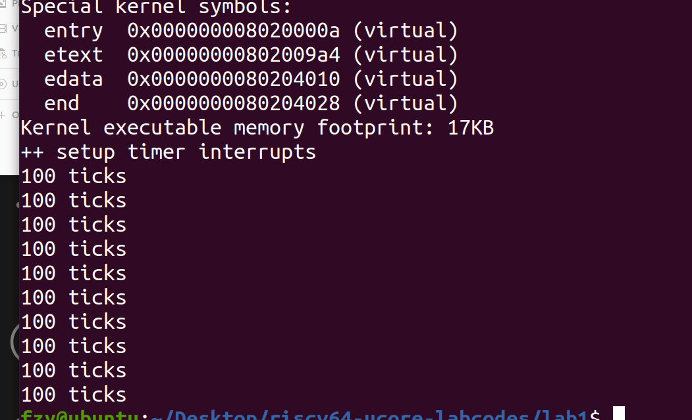
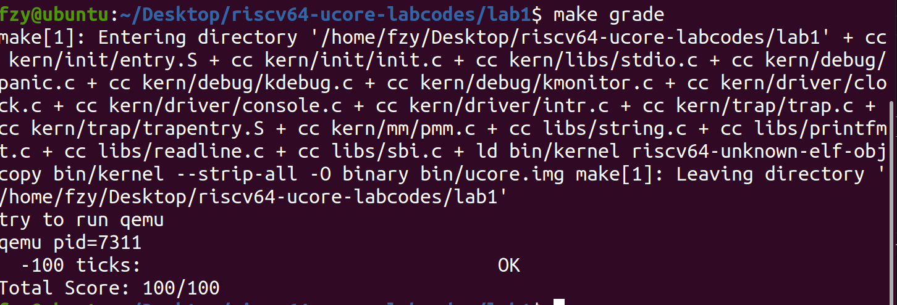
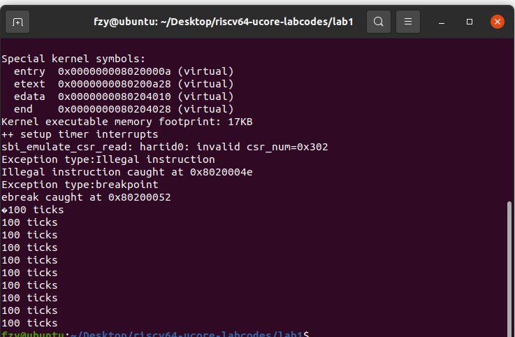
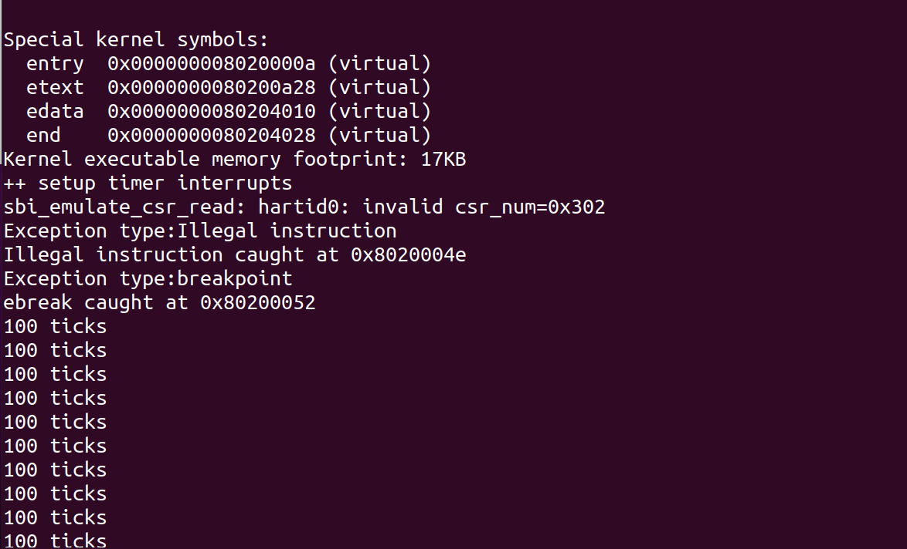

# Lab 1 实验报告
## Lab 1 练习 1：理解内核启动中的程序入口操作

> 阅读`kern/init/entry.S`内容代码，结合操作系统内核启动流程，说明指令 `la sp, bootstacktop `完成了什么操作，目的是什么？ `tail kern_init `完成了什么操作，目的是什么？

1. `la sp, bootstacktop`指令把`bootstacktop`的地址加载到栈指针寄存器`sp`中，此时栈指针指向了内核的栈顶。
这条指令可以将栈指针初始化为内核栈顶，为后续函数调用与中断处理开辟空间。

2. `tail kern_init` 指令完成了尾调用操作，它用于跳转到 `kern_init` 函数并执行该函数。`tail`指令是一个跳转指令，`kern_init` 函数的调用被标记为尾调用。 在执行 `kern_init` 函数之后，`tail`指令告诉编译器不需要保留当前函数的调用帧。因为此时程序已经完成，我们出于性能和栈空间的考虑，不需要保留额外的函数调用信息，这对于嵌入式系统等资源受限的环境中尤其有用。
## Lab 1 练习 2：完善中断处理 
> 请编程完善`trap.c`中的中断处理函数`trap`，在对时钟中断进行处理的部分填写`kern/trap/trap.c`函数中处理时钟中断的部分，使操作系统每遇到100次时钟中断后，调用`print_ticks`子程序，向屏幕上打印一行文字”100 ticks”，在打印完10行后调用`sbi.h`中的`shut_down()`函数关机。
>
> 要求完成相关函数实现，提交改进后的源代码包(可以编译执行)，并在实验报告中简要说明实现过程和定时器中断处理的流程。实现要求的部分代码后，运行整个系统，大约每1秒会输出一次”100 ticks”，输出10行。

### 定时器如何进行中断处理


#### 1.初始化时钟中断


由于OpenSBI提供的接口一次只能设置时钟中断，我们要在初始化函数`clock_init()`里面设置时钟中断。之后发生的时钟中断都应在中断处理函数中设置下一次时钟中断，这样才能实现每隔若干时间发生一次时钟中断。达到这个目的，我们可以用`clock_set_next_event()`函数设置下一次的时钟中断。

找到`clock.c`中的`clock_init（）`，我们对其作简要分析如下：

```c
static uint64_t timebase = 100000;

/* *
设置时间基为100000，下面函数为初始化时钟，使每秒钟中断100次
 * */
void clock_init(void) {
    // 启用SIE寄存器中的时钟中断(MIP_STIP)
    set_csr(sie, MIP_STIP);
    // divided by 500 when using Spike(2MHz)
    // divided by 100 when using QEMU(10MHz)
    // timebase = sbi_timebase() / 500;
    //根据不同的模拟器或硬件环境，系统时钟频率不同，因此需要调整时间基的除数以得到正确的计时单位。这种调整是必要的，因为不同的环境可能需要不同的时间精度或时间间隔。

    clock_set_next_event(); // 设置第一个时钟中断事件

    // 初始化计数器为0
    ticks = 0;

    cprintf("++ setup timer interrupts\n");
}
```
我们利用的QEMU时钟频率为10MHz。在`clock_set_next_event`中调用了`sbi_set_timer`函数，当它获取时间为当前时间加上`timebase`时产生一次中断。
```c
void clock_set_next_event(void) { 
    sbi_set_timer(get_cycles() + timebase); 
}
```
我们找到`sbi_set_timer`函数，对其进行实现的具体分析：

在riscv架构下，S-Mode下的操作系统不能直接设置硬件定时器，而是通过执行`ecall`指令来请求M-Mode帮助设置定时器。这个过程涉及特权模式的切换和异常处理，允许操作系统以安全和受控的方式使用硬件资源。通过`ecall`触发一个` ecall-from-s-mode-exception`，可以请求M-Mode设置定时器。

```c
void sbi_set_timer(unsigned long long stime_value) {
    sbi_call(SBI_SET_TIMER, stime_value, 0, 0);
}
```

```c
uint64_t sbi_call(uint64_t sbi_type, uint64_t arg0, uint64_t arg1, uint64_t arg2) {
    uint64_t ret_val;
    __asm__ volatile (
        "mv x17, %[sbi_type]\n"
        "mv x10, %[arg0]\n"
        "mv x11, %[arg1]\n"
        "mv x12, %[arg2]\n"
        "ecall\n"
        "mv %[ret_val], x10"
        : [ret_val] "=r" (ret_val)
        : [sbi_type] "r" (sbi_type), [arg0] "r" (arg0), [arg1] "r" (arg1), [arg2] "r" (arg2)
        : "memory"
    );
    return ret_val;
}
```

进入M-Mode的中断后，利用它的`mcall_set_timer`函数来设置定时器。

```c
static uintptr_t mcall_set_timer(uint64_t when)
{
  *HLS()->timecmp = when;
  clear_csr(mip, MIP_STIP);
  set_csr(mie, MIP_MTIP);
  return 0;
}
```

在该函数中，首先设置了定时器的触发时间。

- 我们设定`timecmp` 寄存器为当前时间`time`的值+`timebase`。`timecmp` 的值会与 `time` 寄存器进行比较。当 `time` 值变得大于 `timecmp` 时，就会产生一个定时器中断。也就是，相隔`timebase`触发一次时钟中断。

之后，用`clear_csr()`函数清除`mip`中对应的`STIP`位，表示这个中断已经被处理了；并用`set_csr()`函数为`mie`中的`MTIP`置位，让下一次时钟中断能够被触发。

接下来，我们找到`get_cycles()`函数，分析如何获取当前时间。


```c
static inline uint64_t get_cycles(void) {
#if __riscv_xlen == 64
    uint64_t n;
    __asm__ __volatile__("rdtime %0" : "=r"(n));
    return n;
    #在64位架构下，利用rdtime命令读取寄存器time的值
#else
    uint32_t lo, hi, tmp;
    __asm__ __volatile__(
        "1:\n"
        "rdtimeh %0\n"
        "rdtime %1\n"
        "rdtimeh %2\n"
        "bne %0, %2, 1b"
        # 两次读取高位并比较，确保获取的64位时钟周期值在两次获取高32位之间没有发生变化
        : "=&r"(hi), "=&r"(lo), "=&r"(tmp));
    return ((uint64_t)hi << 32) | lo;
        #在32位架构下，把64位的time寄存器存入两个32位整数里，拼起来形成一个64位整数。
#endif
}
```
#### 2.时钟的中断处理

  我们在上一小节分析了如何设置第一个时钟中断，到达触发时间时，会进入下一个中断处理函数。

  在RISC-V架构中，`stvec`寄存器用于存储中断和异常处理程序的入口地址。
- 当CPU在S-Mode下执行时，如果发生了中断（例如时钟中断、硬件中断、软件中断）或异常（例如非法指令、地址错误），CPU会暂停当前执行的指令流，并跳转到`stvec`寄存器所指向的地址。这个地址是操作系统设置的中断和异常处理程序的起始位置。
- 在操作系统的初始化过程中，`idt_init()`函数负责初始化中断描述表（IDT）。在这个函数中，操作系统的代码会将`stvec`寄存器设置为`__alltraps`标签所代表的地址。
- `__alltraps`通常做以下几件事情：
  - 保存当前处理器的状态，包括寄存器的值，这样在中断处理完成后可以恢复到中断前的状态。
  - 调用C语言编写的实际中断处理函数，这些函数会根据中断类型执行相应的操作，例如处理时钟中断、I/O请求等。
  - 在中断处理完成后，恢复处理器状态并返回到中断发生前的指令流。

总之，`stvec`寄存器来指定中断和异常的处理程序入口点，这是实现中断和异常处理机制的关键步骤。

接下来我们分析`trap.c`，并且补充代码，达到实验要求。

在`trap.c`中，我们发现中断处理调用`interrupt_handler()`函数,异常处理`exception_handler()`函数，时钟中断调用`interrupt_handler()`,`case`属于`IRQ_S_TIMER`。

### 代码补全
 - 按照以上的分析，我们要在时钟中断的处理函数中设置下一次时钟中断，故首先调用`clock_set_next_event()`设置下一次时钟中断；
 - `ticks`记录时钟中断次数，每到100次打印一行`100 ticks`在控制台上；
 - 全局变量`num`记录打印次数，打印10次时调用`sbi_shutdown()`关机。

 补充代码如下：
 ```c
 clock_set_next_event();
            ticks++;
            if (ticks % TICK_NUM == 0) {
                    print_ticks();
                    num++;
              }
            if(num == 10){
                    sbi_shutdown();
              }
```
在控制台运行发现输出结果正确：

运行`make qemu`结果如下：


运行`make grade`结果如下：



## Lab1 Challenge 1
### ucore中处理中断异常的流程

1. 项目整体流程分析
- 首先整体代码从`kern/init/entry.S`进入
- 输出一些信息说明正在初始化
- 设置中断向量表(stvec)跳转到的地方为`kern/trap/trapentry.S`里的一个标记
- 在`kern/driver/clock.c`设置第一个时钟事件，使能时钟中断
- 设置全局的S mode中断使能位
- 现在开始不断地触发时钟中断

2. 中断开始
- 执行`clock_init()`函数,在其中的`clock_set_next_event()`函数执行`set_sbi_timer()`通过OpenSBI的时钟事件触发一个中断，跳转到`kern/trap/trapentry.S`的`__alltraps`标记
- 保存当前执行流的上下文，并通过函数调用，切换为`kern/trap/trap.c`的中断处理函数`trap()`的上下文，进入`trap()`的执行流。切换前的上下文作为一个结构体，传递给`trap()`作为函数参数
- `kern/trap/trap.c`按照中断类型进行分发(`trap_dispatch()`, `interrupt_handler()`)
- 执行时钟中断对应的处理语句，累加计数器，设置下一次时钟中断
- 完成处理，返回到`kern/trap/trapentry.S`
- 恢复原先的上下文，中断处理结束。

### mov a0，sp的目的是什么？
`move a0, sp` 的作用是将当前栈指针（sp）的值复制到寄存器 a0 中，用于保存发生中断前栈顶的位置，从而在中断发生并恢复后将栈恢复原状，栈指针也恢复原位。

### SAVE_ALL中寄寄存器保存在栈中的位置是什么确定的？
通过sp指针（指向栈顶）来控制，如下图，将栈顶上移36个寄存器的位置，然后以sp的位置为基础，计算偏移来存储32个x寄存器和四个csr寄存器的内容


### __alltraps 中都需要保存所有寄存器吗？
在 uCore 中，__alltraps 函数通常会保存所有寄存器，但在某些特定情况下，可以不保存所有寄存器：

- 特定类型的异常：如果某些异常处理不会影响大部分寄存器（如仅涉及特定寄存器的算术错误），可能不需要保存所有寄存器。

- 快速中断：在某些高频率的中断处理场景中，如果知道只需关注少数寄存器，可以选择性保存寄存器以提高性能。

- 嵌套异常：在处理嵌套异常时，如果当前上下文的寄存器状态不需要被完整保留（例如，某些寄存器在处理时不被修改），可以不保存所有寄存器。

- 异常处理简单：如果异常处理代码极其简单且不涉及复杂操作，可能选择不保存所有寄存器。

然而，这样的情况需要谨慎处理，以确保不会丢失关键的上下文信息，导致程序状态不一致。

## Lab1 Challenge 2: 理解上下文切换机制

>`问：在trapentry.S中汇编代码 csrw sscratch, sp；csrrw s0, sscratch, x0实现了什么操作，目的是什么？save all里面保存了stval scause这些csr，而在restore all里面却不还原它们？那这样store的意义何在呢？`

1. **`csrw sscratch, sp`**：这个指令将当前的堆栈指针sp保存到控制状态寄存器sscratch中。这通常用于保存当前的上下文，以便在处理异常时能够恢复到正确的状态。这步之后就要对sp进行修改了，所以先保存下sp的值。

2. **`csrrw s0, sscratch, x0`**：这个指令将 sscratch中的值（即之前保存的sp）读取到寄存器s0中，并且将x0零寄存器写入到sscratch，使其清零。而根据约定，若中断前处于S态，sscratch为0。因为我们现在是内核态所以这步也用于给sscratch置零，以便指明现在是内核态。

3. stval会记录一些中断处理所需要的辅助信息，比如指令获取、访存、缺页异常，它会把发生问题的目标地址或者出错的指令记录下来，这样我们在中断处理程序中就知道处理目标了。而scause会记录中断发生的原因，还会记录该中断是不是一个外部中断。因此，在 save all中，保存 stval和 scause等 CSR 是为了记录中断处理程序的处理目标以及中断发生的原因，从而便于去进行中断处理。它们是在中断处理程序运行时需要用的寄存器，当restore all的时候表明异常已经处理完毕了，它们不需要在程序运行完毕的时候继续保存了，因此在restore all的时候不还原他们。而store的意义就在于这两个寄存器在中断处理时发挥了重要的作用，一个指明了中断处理程序的目标，一个指明了中断的原因。此外，我们可以看到trap.c中print_trapframe以及print_regs中都和这几个寄存器的值有关，可能要输出它们的值，因此这里保存下来在转入trap时调用这几个函数都是很有意义的。

## Lab1 Challenge 3：完善异常中断
> 编程完善在触发一条非法指令异常` mret`和断点异常`ebreak`，在` kern/trap/trap.c`的异常处理函数中捕获，并对其进行处理，简单输出异常类型和异常指令触发地址，即`Illegal instruction caught at 0x(地址),ebreak caught at 0x(地址)`与`Exception type:Illegal instruction,Exception type: breakpoint`。
###  触发非法操作

我们增加`mret` `ebreak`两条非法指令，触发非法操作。

```c#
asm("mret");  
asm("ebreak");  
```
值得注意的是，这两条指令要在非法指令必须在`idt_init()`之后插入。
- 在这个函数之前，处理器不知道在哪里处理异常和中断。而在`idt_init`函数中，
操作系统会为各种中断和异常设置相应的处理程序，并将这些处理程序的入口地址存储在异常向量表中。
- 将 `stvec` 寄存器设置为` __alltraps`函数地址后，一旦发生异常，CPU 可以根据异常向量表中对应的位置所存储的跳转地址，找到相应的异常处理程序，并执行其指令。

非法指令的执行必须在执行`sbi_shutdown`之前。

- 我们在打印10次的时候，会调用`sbi.h`中的`sbi_shutdown`函数进行关机。之后的系统不会做任何处理。
###  异常处理代码

补全代码如下：

```c
    case CAUSE_ILLEGAL_INSTRUCTION:
         // 非法指令异常处理
        /*(1)输出指令异常类型( Illegal instruction)
         *(2)输出异常指令地址
         *(3)更新 tf->epc寄存器
        */
        cprintf("Exception type:Illegal instruction\n");
        cprintf("Illegal instruction caught at 0x%08x\n",tf->epc);
        tf->epc+=4;
        break;
    case CAUSE_BREAKPOINT:
        // 断点异常处理
        /*(1)输出指令异常类型( breakpoint)
         *(2)输出异常指令地址
         *(3)更新 tf->epc寄存器
        */
        cprintf("Exception type:breakpoint\n");
        cprintf("ebreak caught at 0x%08x\n",tf->epc);
        tf->epc+=2;            
        break;
```
- 在`RISC-V64`架构中，`epc`寄存器用于存储引发异常的指令地址，因此可以通过该寄存器输出异常指令地址。
- 修改`tf->epc`的值可以实现跳过异常指令，从下一条指令继续执行，这样可以确保在异常处理结束后，程序能够恢复到正确的执行位置。

- 在非法指令异常的处理中，`tf->epc+=4`实现`tf->epc`寄存器的更新，因为`asm("mret")`指令的长度为4个字节；
- 在断点异常的处理中，使用`tf->epc+=2`实现`tf->epc`寄存器的更新，是因为`asm("ebreak")`指令的长度为2个字节。查询得知，`ebreak`为`riscv`的扩展指令，可以被压缩为2个字节。如果错误地将其认为4个字节，会输出一个乱码如下：

可能是读取超过了原来的范围，造成了异常。

### 运行结果
 

 发现触发了相关的异常，并且显示了触发非法操作的地址信息。

## 实验知识点总结
### 上下文切换
程序的保存和恢复是进程控制中最重要的问题之一，PCB（进程控制块）就是为进程之间切换设计的上下文contex存储的数据结构。一个进程对应一个PCB，OS用双向链表存储各个PCB（双向链表比数组易于删除和添加）。内核为每个进程维护了对应的进程控制块（PCB)，将相同状态的进程的PCB放置在同一队列

- 进程切换(上下文切换)
    - 暂停当前运行进程，从运行状态变成其他状态
    - 调度另一个进程从就绪状态变成运行状态
- 进程切换的要求
    - 切换前，保存进程上下文
    - 切换后，恢复进程上下文
    - 快速切换
- 进程生命周期的信息
    - 寄存器 (PC, SP, …)
    - CPU状态
    - 内存地址空间

### 异常与中断处理
- 异常 (Exception)，指在执行一条指令的过程中发生了错误，此时我们通过中断来处理错误。最常见的异常包括：访问无效内存地址、执行非法指令 (除零)、发生缺页等。他们有的可以恢复 (如缺页)，有的不可恢复 (如除零)，只能终止程序执行。

- 外部中断 (Interrupt)，简称中断，指的是 CPU 的执行过程被外设发来的信号打断，此时我们必须先停下来对该外设进行处理。典型的有定时器倒计时结束、串口收到数据等。

RISCV 架构还有大量的控制状态寄存器：
- sepc(supervisor exception program counter)，它会记录触发中断的那条指令的地址；
- scause，它会记录中断发生的原因，还会记录该中断是不是一个外部中断；
- stval，它会记录一些中断处理所需要的辅助信息，比如指令获取 (instruction fetch)、访存、缺页异常，它会把发生问题的目标地址或者出错的指令记录下来，这样我们在中断处理程序中就知道处理目标了。

