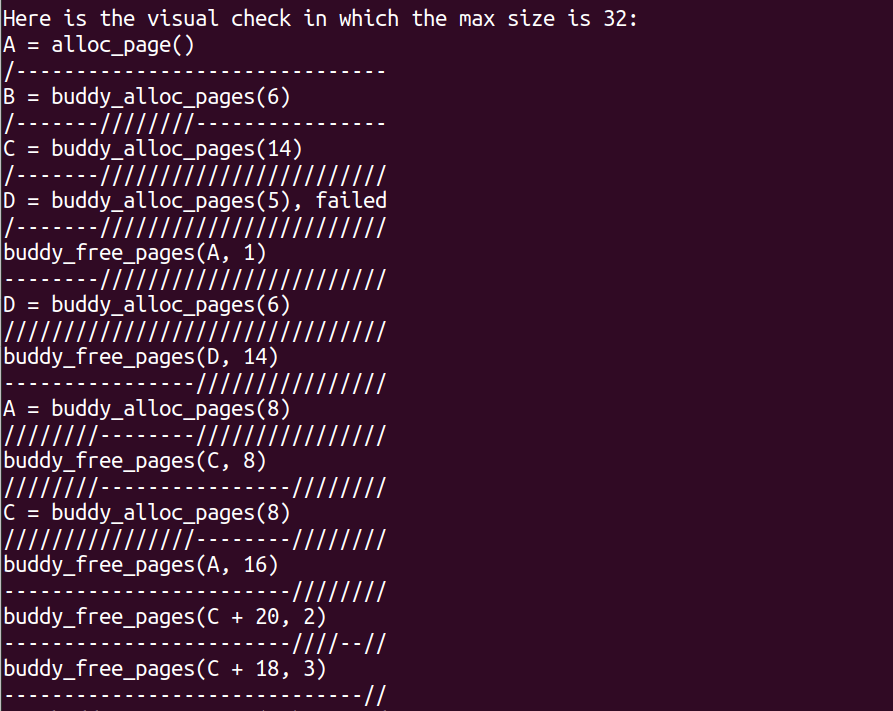

# Lab 2 实验报告
## 练习1: 理解first-fit 连续物理内存分配算法
>   first-fit 连续物理内存分配算法作为物理内存分配一个很基础的方法，需要同学们理解它的实现过程。请大家仔细阅读实验手册的教程并结合kern/mm/default_pmm.c中的相关代码，**认真分析default_init，default_init_memmap，default_alloc_pages， default_free_pages等相关函数，并描述程序在进行物理内存分配的过程以及各个函数的作用**。 请在实验报告中简要说明你的设计实现过程。请回答如下问题：
>
>**你的first fit算法是否有进一步的改进空间？**

### 1.对相关函数的分析以及作用
#### (1) default_init
```c
static void
default_init(void) {
    list_init(&free_list);
    nr_free = 0;
}
```
**作用：** 该函数的主要作用是初始化双向链表free_list，并将nr_free设置为0。

**分析：** 其中free_list与nr_free的定义来源于memlayout.h

```c
typedef struct {
    list_entry_t free_list;         // the list header
    unsigned int nr_free;           // number of free pages in this free list
} free_area_t;
```
**free_list用于以双向链表的形式记录空闲内存块**，list_init 函数则初始化 free_list，将其设置为空链表。该函数的定义来源于list.h，如下所示：
```c
static inline void
list_init(list_entry_t *elm) {
    elm->prev = elm->next = elm;
}
```
list_init是静态内联函数，用于初始化链表节点。（静态意味着这个函数只能在定义它的文件内部被调用，内联意味着编译器会尝试将这个函数调用替换为函数体本身，以减少函数调用的开销）。

通过函数的定义，我们可以看到函数的参数elm是list_entry_t类型的的指针，而我们调用该函数的时候传递的正是该类型变量的地址。elm是指向链表节点的指针，这个函数主要用于初始化一个空链表，即将节点的前一个节点和后一个节点都指向了自己。

**nr_free是空闲内存块的总数**，将其设置为 0，表示当前没有可用的空闲内存块。

#### (2) default_init_memmap
 
 **作用：** 此函数用于初始化一个空闲块，包括初始化空闲块中的每个页面并计算空闲内存块的总数。  

 **分析：** 该函数定义如下：
```c
default_init_memmap(struct Page *base, size_t n) 
```
 **第一个参数是此空闲块中空闲页面的起始地址** ，类型为结构体page的指针。以下是结构体Page的定义（来源于memlayout.h）：
 ```c
 struct Page {
    int ref;                        // page frame's reference counter
    uint64_t flags;                 // array of flags that describe the status of the page frame
    unsigned int property;          // the num of free block, used in first fit pm manager
    list_entry_t page_link;         // free list link
};
```


• **ref:** 页框（物理页面）的引⽤计数器，用于跟踪有多少虚拟页引用了该物理页面。

• **flags：** 描述该物理⻚状态的标记位数组，它包括两个标记位，即PG_reserved和PG_property。PG_reserved表明该物理页⻚是否被保留或占用，PG_property表⽰该物理页是否是空闲块中连续空闲物理页的首页。

• **property：** 用于记录连续的空闲⻚的数量，只有当其是空闲块的⾸个页面时，才会被设置，其他时候为0。

• **page_link：**  用于将这个空闲页（实质上应该是代表的空闲内存块）链接到记录所有空闲内存块的双向链表的指针。

**第二个参数n是此空闲块中空闲页面的数量。**

 为了初始化此空闲块中的每个页面（在memlayout.h中），我们首先要在p->flags应设置PG_property位（表示此页面有效）。
 
 注：在pmm.c的pmm_init（调用page_init）函数中，我们已经设置了p->flags的PG_reserved位。
 
 如果此页面是空闲的且不是空闲块的第一个页面，则p->property应设置为0。如果此页面是空闲的且是空闲块的第一个页面，则p->property应设置为块的总数。  
 
 我们还要设置p->ref应为0，因为现在p是空闲的且没有引用。  
 
 并且我们可以使用p->page_link将此页面链接到空闲链表。注意我们链接的时候是按照地址从小到大进行的。

 最后，我们应该计算空闲内存块的总数，即nr_free += n。  

**该函数的详细注释如下：**
```c
// 定义一个静态函数default_init_memmap，用于初始化空闲内存块 
static void  
default_init_memmap(struct Page *base, size_t n) {  
    // 断言n大于0，确保传入的空闲页面数量是有效的  
    assert(n > 0);  
      
    // 定义一个指向页面结构体的指针p，并将其初始化为指向base  
    struct Page *p = base;  
      
    // 遍历从base开始的n个页面  
    for (; p != base + n; p++) {  
        // 断言页面p没有被保留或占用
        assert(PageReserved(p));  
          
        // 将页面p的flags和property成员都设置为0  
        p->flags = p->property = 0;  
          
        // 将页面p的引用计数设置为0，表示这个物理页面页面当前没有被引用  
        set_page_ref(p, 0);  
    }  
      
    // 将base页面的property成员设置为n，因为base是空闲内存块的开始页面，需要记录连续的空闲页数  
    base->property = n;  
      
    // 调用SetPageProperty，设置base这个页面的标志位，即将flags的PG_property设置为1,因为base是连续物理页的首页。
    SetPageProperty(base);  
      
    // 增加全局变量nr_free的值，表示空闲页面的数量增加了n个  
    nr_free += n;  
      
    // 检查空闲页面链表是否为空  
    if (list_empty(&free_list)) {  
        // 如果空闲页面链表为空，则直接将base页面添加到链表中  
        list_add(&free_list, &(base->page_link));  
    } else {  
        // 如果空闲页面链表不为空，则需要找到正确的位置将base页面插入到列表中  
        list_entry_t* le = &free_list;  
          
        // 遍历空闲页面列表，找到正确的插入位置 。遍历过程中，地址在逐渐增加 
        while ((le = list_next(le)) != &free_list) {  
            // 将le转换为对应的页面指针  
            struct Page* page = le2page(le, page_link);  
              
            // 如果base页面刚好在遍历到的页面地址之前，则在le之前插入base页面  
            if (base < page) {  
                list_add_before(le, &(base->page_link));  
                break;  
            } else if (list_next(le) == &free_list) {  
                // 如果已经遍历到链表的末尾，则在链表的末尾插入base页面  
                //即le的下一个是链表头，表示le应该是链表末尾，于是将base插在
                //le的后面形成新的链表末尾。
 
                list_add(le, &(base->page_link));  
            }  
        }  
          
       
    }  
}
```

#### （3）default_alloc_pages

**功能：** 该函数用于在空闲列表中搜索找到第一个空闲块（块大小>=n），然后调整空闲块大小，并返回已分配块的地址。即主要完成first-fit分配算法。  

**分析：** 

该算法查询空闲块的思路主要是从空闲链表的头部开始查找，直到找到空闲块中连续的空闲物理页大于等于n时停止，并且将该空闲块中的前n个页面分配给请求。（注意我们刚才已经分析过我们链表的组织是按照地址从低到高组织的）

然后我们将该页的flags的标志位进行设置，即PG_reserved = 1, PG_property = 0。 并从空闲链表中取消链接这个页面page。

接下来，我们重新计算此空闲块剩余部分的页面数量，找到分配该空闲块分配n个页面后的第一个页面p。设置它的flags的PG_property为1,表明它是新的连续物理页的首页。而它的property应为原page的property-n。而为了将它链接到原空闲链表中，我们要记录空闲双向链表中原page的前一个page（即prev），并将p插在这个的后面，保证我们空闲链表中的组织方式依旧是按照地址从低到高。

最后，我们要重新计算nr_free（所有空闲块剩余部分的总数）。 

**该函数的详细注释如下：**
```c
// 定义一个函数，接收一个size_t类型的参数n，表示要分配的页面数，返回一个指向Page
//结构的指针。  
static struct Page *  
default_alloc_pages(size_t n) {  
    // 断言n必须大于0，确保不会请求0个页面或负数页面。  
    assert(n > 0);  
      
    // 如果请求的页面数大于当前可用的自由页面数，则无法分配，返回NULL。  
    if (n > nr_free) {  
        return NULL;  
    }  
      
    // 初始化一个指向Page结构的指针page为NULL，用于存储找到的满足条件的页面。  
    struct Page *page = NULL;  
      
    // 定义一个指向list_entry_t结构的指针le，并初始化为指向free_list的起始位置,即链表头  
    list_entry_t *le = &free_list;  
      
    // 遍历free_list，查找第一个满足条件的页面。  
    while ((le = list_next(le)) != &free_list) {  
        // 使用le2page宏和page_link成员从list_entry_t结构中获取对应的Page结构指针。  
        struct Page *p = le2page(le, page_link);  
          
        // 如果找到的页面的连续空闲页面数大于等于请求的页面数n，则满足条件。  
        if (p->property >= n) {  
            page = p;  
            break;  
        }  
    }  
      
    // 如果找到了满足条件的页面
    if (page != NULL) {  
        // 获取page在空闲链表中的前一个元素的指针。  
        list_entry_t* prev = list_prev(&(page->page_link));  
          
        // 从free_list中删除page。  
        list_del(&(page->page_link));  
          
        // 如果连续的空闲页面数大于请求的页面数n，则需要对page进行分割。  
        if (page->property > n) {  
            // 计算新的Page的起始地址，即page之后n个单位的位置。  
            struct Page *p = page + n;  
              
            // 设置新Page的property为剩余的连续页面数。  
            p->property = page->property - n;  
              
            // 调用SetPageProperty函数用于设置这个新页面的标志位，即将flags
            //的PG_property设置为1,因为p是新的连续物理页的首页。  
            SetPageProperty(p);  
              
            // 将新的Page结构添加到free_list中，插入位置为prev之后，即原page
            //的位置。保证我们空闲链表中的组织方式依旧是按照地址从低到高。 
            list_add(prev, &(p->page_link));  
        }  
          
        // 更新全局的空闲页面数nr_free，减去已分配的页面数n。  
        nr_free -= n;  
          
        // 调用ClearPageProperty函数用于清除刚已分配页面的属性位，即将
        //page->flags的PG_property设置为0。  
        ClearPageProperty(page);  
    }  
      
    // 返回找到的满足条件的页面指针，如果没有找到则返回NULL。  
    return page;  
}
```

#### （4）default_free_pages

**作用：**  该函数主要用于将页面重新链接到空闲列表，并且根据空闲块的地址可能会将小空闲块合并成大空闲块。 

**分析：**

该函数定义如下：
```c
default_free_pages(struct Page *base, size_t n) 
```
第一个参数是此空闲块中空闲页面的起始地址，第二个参数是此空闲块中空闲页面的数量。

首先，我们将把从首页面开始的n个页面的flags标志位设置为0，并将ref（页框引⽤计数器）设置为0，表示该物理页面其被虚拟页的引用次数为0。

然后我们将base作为连续空闲物理页的第一页，将其property属性设置为n，表明连续的空闲物理页数为n，并设置flags标志位中的PG_property为1。

之后，我们要重新计算nr_free（所有空闲块剩余部分的总数），要加上我们刚才释放的n个空闲页面。

接下来，我们可以使用base->page_link将此页面链接到空闲链表。注意我们链接的时候是依旧是按照地址从小到大进行的。

之后，我们尝试合并低地址或高地址块。以低地址为例：
我们首先找到空闲双向链表中base的前继指针，如果这个连续空闲块后的地址（用prev+prev->property表示，即首页面的基地址加上连续的空闲页面数）恰好是base的基地址，我们就做合并处理。

合并的思路为改变prev的property，要加上base->property，并且要清除base页面的flags标志位中的PG_property，将其设置为0。并在空闲链表中删除base，把p赋值给base。

**该函数的详细注释如下：**

```c

// 定义一个静态函数，用于释放一组连续的空闲页面。  
static void  
default_free_pages(struct Page *base, size_t n) {  
    // 断言n必须大于0，确保不会尝试释放0个页面。  
    assert(n > 0);  
      
    // 定义一个指向Page结构的指针p，初始化为指向要释放的页面组的起始位置。  
    struct Page *p = base;  
      
    // 遍历要释放的页面组，对每个页面进行检查和清理。  
    for (; p != base + n; p++) {  
        // 断言页面没有被保留且PG_Property值为0。  
        assert(!PageReserved(p) && !PageProperty(p));  
          
        // 清除页面的flags标志位。  
        p->flags = 0;  
          
        // 将页面的引用计数设置为0。  
        set_page_ref(p, 0);  
    }  
      
    // 设置页面组的连续空闲页数为n。  
    base->property = n;  
      
    // 设置页面组的起始页面的PG_Property为1，标志base是连续空闲页面的第一页。
    SetPageProperty(base);  
      
    // 更新全局的自由页面数nr_free，加上释放的页面数n。  
    nr_free += n;  
      
    // 判断free_list是否为空。  
    if (list_empty(&free_list)) {  
        // 如果为空，直接将页面组添加到free_list的起始位置。  
        list_add(&free_list, &(base->page_link));  
    } else {  
        // 如果不为空，遍历free_list以找到合适的插入位置。  
        list_entry_t* le = &free_list;  
        while ((le = list_next(le)) != &free_list) {  
            // 从list_entry_t结构中获取对应的Page结构指针。  
            struct Page* page = le2page(le, page_link);  
              
            // 如果base页面在遍历到的页面地址之前，则在遍历到的页面之前插入base页面组。  我们链表中的地址是从低到高组织的，这样可以确保插入base后链表依旧是按照地址从低到高组织的。
            if (base < page) {  
                list_add_before(le, &(base->page_link));  
                break;  
            } else if (list_next(le) == &free_list) {  
                
                // 如果已经遍历到链表的末尾，则在链表的末尾插入base页面  
                //即le的下一个是链表头，表示le应该是链表末尾，插在le的后面形成
                //新的链表末尾。  
                list_add(le, &(base->page_link));  
            }  
        }  
    }  
      
    // 检查base页面组在空闲链表中的前一个页面是否存在且相邻。  
    list_entry_t* le = list_prev(&(base->page_link));  
    if (le != &free_list) {  
        p = le2page(le, page_link);  
        // 如果前一个空闲块的末尾与base页面组的起始相邻，则合并它们。  
        if (p + p->property == base) {  
            p->property += base->property;  
            // 清除base页面组的标志。  
            ClearPageProperty(base);  
            // 从free_list中删除base页面组的链接。  
            list_del(&(base->page_link));  
            // 更新base指针为合并后的页面组的起始位置。  
            base = p;  
        }  
    }  
      
    // 检查base页面组的后一个页面是否存在且相邻。  
    le = list_next(&(base->page_link));  
    if (le != &free_list) {  
        p = le2page(le, page_link);  
        // 如果base页面组的末尾与后一个内存块的起始相邻，则合并它们。  
        if (base + base->property == p) {  
            base->property += p->property;  
            // 清除后一个页面的标志位。  
            ClearPageProperty(p);  
            // 从free_list中删除后一个空闲块的链接。  
            list_del(&(p->page_link));  
        }  
    }  
}

```

### 2.程序在进行物理内存分配的过程

首先，我们在kern_init()里，新增一个调用新函数pmm_init()的接口并调用该函数。pmm_init()主要就是用来主要负责初始化物理内存管理，该函数定义在pmm.c文件。

该函数中我们首先利用init_pmm_manager()函数基于在pmm.h中定义的物理内存管理器的框架初始化一个物理内存管理器（pmm）。初始化的过程实质上是把我们已经定义的pmm_manager结构体的地址赋值给pmm_manager，然后调用这个结构体中的写好的init()函数。

接下来我们调用page_init()给管理物理内存的结构体做初始化。该结构体是page，我们用它存储”当前使用了哪些物理页面，哪些物理页面没被使用“这样的信息。

在page_init()函数中，我们用pmm->init_memmap来创建空闲页面链表，这个init_memmap实质上是调用了pmm_manager结构体（在pmm.h中定义）的一个成员函数。值得注意的是，我们可以根据不同物理内存分配算法构造不同的pmm_manager结构体，并实现它的接口函数以实现物理内存的分配与释放等功能。（比如说default_init_memmap，default_free_pages）

而本算法物理内存的分配主要是遍历按照地址从低到高组织的空闲链表，查找第一个连续的空闲页面数大于等于所需页面数的节点，把这个页面对应的连续的空闲块进行恰好的分配（即就分配所需的n个页面），剩余不需要的页面放回原空闲链表中。释放时也是遍历这个链表，按照内存地址将这个空闲块放入空闲链表中，并进行相邻空闲块的合并操作。

### 3.first fit算法进一步的改进空间

#### （1）延迟合并

考虑到每次内存释放时立即进行合并可能会增加时间开销，我们可以采用延迟合并策略，在一定条件下或者触发时机进行合并操作，将内存释放时的合并操作推迟到系统认为合适的时机，比如当空闲内存达到某个阈值时或者在分配内存请求失败时，触发一次全局的合并操作，以最大化可用内存。这样减少了释放内存时的合并开销，优化系统性能，但仍然在必要时合并以减少碎片化。

#### （2）减少外部碎片——内存块分裂的优化

在 First-Fit 分配时，当找到的空闲块比所需的内存大时，我们会将这个空闲块进行分裂，将所需的物理页面进行分配，保留剩余部分作为新的空闲块。但这样会导致碎片化问题，因此可以通过对分裂操作进行优化来减少外部碎片。比如说，我们设置一个最小块大小阈值，如果剩余的内存小于某个最小块大小，则不分裂空闲块，而是将整个块分配出去。这可以减少小块碎片的生成。

#### （3）提高内存利用率
在处理连续的大请求时，First-Fit算法可能会遇到困难，因为分配可能会跳过很多小的空闲区，导致大空闲区被浪费。我们可以通过改进分配策略，如引入预测机制来预测未来可能的内存需求，并据此调整空闲区的分配，以提高内存利用率。

## 练习2: 实现 Best-Fit 连续物理内存分配算法
>   在完成练习一后，参考kern/mm/default_pmm.c对First Fit算法的实现，**编程实现Best Fit页面分配算法**，算法的时空复杂度不做要求，能通过测试即可。 请在实验报告中简要说明你的**设计实现过程，阐述代码是如何对物理内存进行分配和释放**，并回答如下问题：
>
>**你的 Best-Fit 算法是否有进一步的改进空间？**

### 1.设计实现过程

首先，Best-Fit分配算法要求的是选择大小最接近且能满足请求的内存块。为了满足这个要求我们可以有两种设计：

（1）将空闲链表总是按照property的大小从小到大组织，即按照空闲块的大小从小到大组织空闲链表，这样我们为了找到分配出去的空闲块只需要从头遍历链表，直到找到第一个能够大于等于所需空闲块大小的页面p，然后我们依旧准确的将这个p分裂，一部分是所需的空闲块大小，另一部分是剩下的。然后我们将剩下的空闲块根据它的大小连接到空闲链表中。

但这个设计的问题是碎片过多，并且由于我们并没有按地址组织链表，所以合并碎片的过程也很复杂，时间开销特别大。而如果不合并碎片，则可能会产生一种情况--即其实连续的空闲块可以满足需求但是由于我们没合并，所以我们还是无法返回所请求的空闲块。

（2）这种设计就是我们依然按照地址从小到大组织空闲链表，但此时为了找到最好的空闲块，我们需要遍历整个链表，并时刻记录此时找到的最好的页面。当遍历完整个链表后，我们依然可以找到最好的空闲块。这种设计虽然需要遍历整个链表，但是我们合并碎片时会非常方便，因为我们的链表是按照地址大小组织的，只要判断即将分配出去的空闲块的前继后继节点是否满足合并的条件即可，而由于我们使用的是双向链表，所以找前继后继节点也十分方便。

综上，我们本次采用第二种设计方案，即依旧按照地址从小到大组织空闲链表。

接下来讲解我们填写的TO-DO代码以及其主要逻辑。

#### （1）best_fit_init_memmap（）函数

首先，填写完TO-DO部分我们整体的函数代码如下所示：

```c
static void
best_fit_init_memmap(struct Page *base, size_t n) {
    assert(n > 0);
    struct Page *p = base;
    for (; p != base + n; p ++) {
        assert(PageReserved(p));

        /*LAB2 EXERCISE 2: YOUR CODE*/ 
        // 清空当前页框的标志和属性信息，并将页框的引用计数设置为0
        p->flags = p->property = 0;
        set_page_ref(p, 0);
    }
    base->property = n;
    SetPageProperty(base);
    nr_free += n;
    if (list_empty(&free_list)) {
        list_add(&free_list, &(base->page_link));
    } else {
        list_entry_t* le = &free_list;
        while ((le = list_next(le)) != &free_list) {
            struct Page* page = le2page(le, page_link);
             /*LAB2 EXERCISE 2: YOUR CODE*/ 
            // 编写代码
            // 1、当base < page时，找到第一个大于base的页，将base插入到它前面，并退出循环
            // 2、当list_next(le) == &free_list时，若已经到达链表结尾，将base插入到链表尾部
            if (base < page) {
                list_add_before(le, &(base->page_link));
                break;
            } else if (list_next(le) == &free_list) {
                list_add_after(le, &(base->page_link));
            }
        }
    }
}
```
整个函数主要用于初始化一个空闲块，包括初始化空闲块中的每个页面并计算空闲内存块的总数。  

第一个TO-DO所在的for循环主要用于遍历我们需要初始化的n个页面。初始化操作包括设置page结构体的各个属性。已有的代码完成了断言page->flags的PG_Reserved为0，即其没有被保留或占用。而我们要做的是先将所有页面的property属性设置为0（后续代码已经设置了空闲块首页的property的值），以及将flags都清零，表明其不是空闲块的首页以及没有被保留（后续的代码已经设置空闲块首页的PG_Property的值）。除此之外，我们要设置这些页面的ref属性为0，表示这个物理页面页面当前没有被引用 。

于是，我们填写的代码如下, 清空了当前页框（物理页面）的标志和属性信息，并将页框的引用计数设置为0：

```c
        p->flags = p->property = 0;
        set_page_ref(p, 0);
```

第二个TO-DO所在的while循环正在遍历空闲页面列表，找到空闲块正确的插入位置。由于我们的空闲链表是按照地址从低到高组织的，因此我们插入的逻辑就是从头开始遍历，一旦base（即我们要插入的空闲块的基地址）小于遍历到的地址，说明我们找到了正确的插入位置。我们在编写代码时要注意两个特殊情况，一个是链表为空，那我们直接将base页面添加到链表中 。一个是我们已经遍历到了链表的尾部，说明base地址比链表中所有地址都大，那我们就插到尾部的后面，让base成为链表的尾部。

于是，我们填写的代码以及注释如下：

```c
 // 如果base页面刚好在遍历到的页面地址之前，则在le之前插入base页面  
 //即当base < page时，找到第一个大于base的页，将base插入到它前面，并退出循环
            if (base < page) {  
                list_add_before(le, &(base->page_link));  
                break;  
            } else if (list_next(le) == &free_list) {  
                // 如果已经遍历到链表的末尾，则在链表的末尾插入base页面  
                //即le的下一个是链表头，表示le应该是链表末尾，于是将base插在le
                //的后面形成新的链表末尾。

                list_add(le, &(base->page_link));
            }
```

#### (2)best_fit_alloc_pages（）函数

首先，填写完TO-DO部分我们整体的函数代码如下所示：

```c
static struct Page *
best_fit_alloc_pages(size_t n) {
    assert(n > 0);
    if (n > nr_free) {
        return NULL;
    }
    struct Page *page = NULL;
    list_entry_t *le = &free_list;
    size_t min_size = nr_free + 1;
     /*LAB2 EXERCISE 2: YOUR CODE*/ 
    // 下面的代码是first-fit的部分代码，请修改下面的代码改为best-fit
    // 遍历空闲链表，查找满足需求的空闲页框
    // 如果找到满足需求的页面，记录该页面以及当前找到的最小连续空闲页框数量
    while ((le = list_next(le)) != &free_list) {
        struct Page *p = le2page(le, page_link);
        if (p->property >= n && p->property<min_size) {
            page = p;
            min_size=p->property;
=
        }
    }

    if (page != NULL) {
        list_entry_t* prev = list_prev(&(page->page_link));
        list_del(&(page->page_link));
        if (page->property > n) {
            struct Page *p = page + n;
            p->property = page->property - n;
            SetPageProperty(p);
            list_add(prev, &(p->page_link));
        }
        nr_free -= n;
        ClearPageProperty(page);
    }
    return page;
}
```
该函数用于在空闲列表中搜索找到一个最合适的空闲块（块大小>=n且最接近n），然后调整空闲块大小，并返回已分配块的地址。即主要完成best-fit分配算法。

TO-DO所在的while循环正是用于找到最合适的空闲块。我们可以看到之前的代码已经完成了min_size的声明与初始化。该变量主要用于记录我们目前找到的最接近n且大于等于n的连续空闲块的页数。我们初始化为当前所有空闲的页数+1的值。

我们寻找的逻辑是从头开始遍历，并且遍历整个链表，即循环终止条件是遍历到了链表的尾部，中间不会break。当我们遍历时遇到了一个空闲块满足所需要求并且它的页面数要小于我们目前找到满足要求的空闲块的页面数，我们就将最后返回的page先设置为当前遍历到的页面，并将min_size设置为它的页面数量。只要遍历完整个链表，我们就能找到最合适的空闲块。

而下面的if里的代码我们不做修改。我们依旧重新计算此空闲块剩余部分的页面数量，找到分配该空闲块分配n个页面后的第一个页面p。设置它的flags的PG_property为1,表明它是新的连续物理页的首页。而它的property应为原page的property-n。而为了将它链接到原空闲链表中，我们要记录空闲双向链表中原page的前一个page（即prev），并将p插在这个的后面，保证我们空闲链表中的组织方式依旧是按照地址从低到高。

于是，我们填写的代码以及注释如下：

```c
    // 遍历空闲链表，查找满足需求的空闲页框
    while ((le = list_next(le)) != &free_list) {
        // 使用le2page宏和page_link成员从list_entry_t结构中获取对应的Page结构指针。  
        struct Page *p = le2page(le, page_link);
    // 如果找到满足需求的页面，记录该页面以及当前找到的最小连续空闲页框数量


        if (p->property >= n && p->property<min_size) {
            page = p;
            min_size=p->property;
            
        }
    }

```
#### (3)best_fit_free_pages()函数

首先，填写完TO-DO部分我们整体的函数代码如下所示：

```c
static void
best_fit_free_pages(struct Page *base, size_t n) {
    assert(n > 0);
    struct Page *p = base;
    for (; p != base + n; p ++) {
        assert(!PageReserved(p) && !PageProperty(p));
        p->flags = 0;
        set_page_ref(p, 0);
    }
    /*LAB2 EXERCISE 2: YOUR CODE*/ 
    // 编写代码
    // 具体来说就是设置当前页块的属性为释放的页块数、并将当前页块标记为已分配状态、最后增加nr_free的值
    base->property = n;
    SetPageProperty(base);
    nr_free += n;


    if (list_empty(&free_list)) {
        list_add(&free_list, &(base->page_link));
    } else {
        list_entry_t* le = &free_list;
        while ((le = list_next(le)) != &free_list) {
            struct Page* page = le2page(le, page_link);
            if (base < page) {
                list_add_before(le, &(base->page_link));
                break;
            } else if (list_next(le) == &free_list) {
                list_add(le, &(base->page_link));
            }
        }
    }

    list_entry_t* le = list_prev(&(base->page_link));
    if (le != &free_list) {
        p = le2page(le, page_link);

        if (p + p->property == base) {
            p->property += base->property;
            ClearPageProperty(base);
            list_del(&(base->page_link));
            base = p;
        }
        /*LAB2 EXERCISE 2: YOUR CODE*/ 
         // 编写代码
        // 1、判断前面的空闲页块是否与当前页块是连续的，如果是连续的，则将当前页块合并到前面的空闲页块中
        // 2、首先更新前一个空闲页块的大小，加上当前页块的大小
        // 3、清除当前页块的属性标记，表示不再是空闲页块
        // 4、从链表中删除当前页块
        // 5、将指针指向前一个空闲页块，以便继续检查合并后的连续空闲页块
        
    }

    le = list_next(&(base->page_link));
    if (le != &free_list) {
        p = le2page(le, page_link);
        if (base + base->property == p) {
            base->property += p->property;
            ClearPageProperty(p);
            list_del(&(p->page_link));
        }
    }
}

```

该函数主要用于将页面重新链接到空闲列表，并且根据空闲块的地址可能会将小空闲块合并成大空闲块。 

第一个TO-DO部分，具体来说就是设置当前页块的属性为释放的页块数（即n）、并将当前页块标记为已分配状态（即作为新的空闲块的第一个物理页）、最后增加nr_free的值，加上我们刚释放的n个页面。

于是，我们填写的代码如下：

```c
    base->property = n;
    SetPageProperty(base);
    nr_free += n;
```

第二个TO-DO部分我们尝试合并低地址块。我们首先找到空闲双向链表中base的前继指针，如果这个连续空闲块后的地址（用prev+prev->property表示，即首页面的基地址加上连续的空闲页面数）恰好是base的基地址，我们就做合并处理。即判断前面的空闲页块是否与当前页块是连续的，如果是连续的，则将当前页块合并到前面的空闲页块中

合并的思路为改变prev的property，更新前一个空闲页块的大小，要加上base->property（表示这个新的空闲块的连续空闲页面的数目为两个的和），并且要清除base页面的flags标志位中的PG_property，将其设置为0，表明其不再是空闲页块。并在空闲链表中删除base，最后把p赋值给base，以便继续检查合并后的连续空闲页块。

于是，我们填写的代码以及注释如下：

```c
    list_entry_t* le = list_prev(&(base->page_link));  
    if (le != &free_list) {  
        p = le2page(le, page_link);  
        // 如果前一个空闲块的末尾与base页面组的起始相邻，则合并它们。  
        if (p + p->property == base) {  
            p->property += base->property;  
            // 清除base页面组的标志。  
            ClearPageProperty(base);  
            // 从free_list中删除base页面组的链接。  
            list_del(&(base->page_link));  
            // 更新base指针为合并后的页面组的起始位置。  
            base = p;  
        }  
    }  

```

### 2.运行截图


我们可以看到ucore在显示其entry（入口地址）、etext（代码段截止处地址）、edata（数据段截止处地址）、和end（ucore截止处地址）的值后，ucore显示了物理内存的布局信息，其中包含了内存范围。接下来ucore会以页为最小分配单位实现一个简单的内存分配管理，完成页表的建立，进入分页模式，执行各种我们设置的检查，最后显示ucore建立好的页表内容，并在分页模式下响应时钟中断。

make grade的截图如下：


### 3.程序在进行物理内存分配的过程

首先，我们在kern_init()里，新增一个调用新函数pmm_init()的接口并调用该函数。pmm_init()主要就是用来主要负责初始化物理内存管理，该函数定义在pmm.c文件。

该函数中我们首先利用init_pmm_manager()函数基于在pmm.h中定义的物理内存管理器的框架初始化一个物理内存管理器（pmm）。初始化的过程实质上是把我们已经定义的pmm_manager结构体的地址赋值给pmm_manager，然后调用这个结构体中的写好的init()函数。

接下来我们调用page_init()给管理物理内存的结构体做初始化。该结构体是page，我们用它存储”当前使用了哪些物理页面，哪些物理页面没被使用“这样的信息。

在page_init()函数中，我们用pmm->init_memmap来创建空闲页面链表，这个init_memmap实质上是调用了pmm_manager结构体（在pmm.h中定义）的一个成员函数。值得注意的是，我们可以根据不同物理内存分配算法构造不同的pmm_manager结构体，并实现它的接口函数以实现物理内存的分配与释放等功能。（比如说default_init_memmap，default_free_pages）

而本算法物理内存的分配主要是我们依然按照地址从小到大组织空闲链表，但此时为了找到最好的空闲块，我们需要遍历整个链表，并时刻记录此时找到的最好的页面。当遍历完整个链表后，我们就可以找到最适合的空闲块。之后我们把这个页面对应的连续的空闲块进行恰好的分配（即就分配所需的n个页面），剩余不需要的页面放回原空闲链表中。释放时也是遍历这个链表，按照内存地址将这个空闲块放入空闲链表中，并进行相邻空闲块的合并操作。

### 4.你的 Best-Fit 算法是否有进一步的改进空间？

#### （1） 使用快速查找结构——平衡树或堆 

Best-Fit 算法本质上是一个查找问题，可以通过更高效的数据结构来加快查找速度。可以使用平衡二叉树（如 AVL 树或红黑树）或者最小堆来存储空闲块，以便快速找到最接近请求大小的块。我们通过将空闲块按大小插入到平衡二叉树或最小堆中，保持数据结构的有序性。在分配内存时，快速找到大于或等于请求大小的最小空闲块。在释放内存时，将新释放的块重新插入到树或堆中。

通过使用二叉树或堆，查找最合适的空闲块时间复杂度可以降到 O(log n)，相比传统链表的 O(n) 显著提升了效率。

#### （2）内存碎片管理

尽管Best-Fit算法有助于减少内存碎片，但在长期运行过程中，仍然可能会产生一些难以利用的外部碎片。因此可以引入内存碎片整理机制，定期或按需对内存块进行合并和重组，以减少外部碎片的产生。

此外，我们仍可以采用延迟合并的策略，即在一定条件下或者触发时机进行合并操作，将内存释放时的合并操作推迟到系统认为合适的时机，比如当空闲内存达到某个阈值时或者在分配内存请求失败时，触发一次全局的合并操作，以最大化可用内存。这样减少了释放内存时的合并开销，优化系统性能，但仍然在必要时合并以减少碎片化。

## challenge1: Buddy System实现

### 基本原理

Buddy System（伙伴系统）是一种内存分配算法，它将内存划分为大小相等的块，每个块的大小都是2的幂次方.

这些块组成了一个二叉树结构，其中根节点表示整个可用内存，而叶子节点表示最小的内存块。除根结点外，每个节点都有一个与之关联的伙伴节点。以实现高效的内存分配和释放。

1. **内存划分**：Buddy System将内存划分为若干个大小为2的幂次方的块。例如，假设系统有1MB的内存，可以将其划分为1KB、2KB、4KB、8KB、16KB等大小的块;

2. **伙伴关系**：大小相同的块称为“伙伴”。两个伙伴在物理地址上是连续的，并且它们的起始地址是2的幂次方的关系。例如，一个起始地址为0x1000的4KB块，其伙伴的起始地址可能是0x2000;

3. **分配策略**：当需要分配内存时，Buddy System会寻找大小最合适的块进行分配。如果找不到大小恰好合适的块，它会选择稍大一点的块，并将其一分为二，直到找到合适大小的块;

4. **合并策略**：当释放内存时，Buddy System会检查相邻的块是否为伙伴。如果是，它会将这两个伙伴合并为一个更大的块，从而减少内存碎片;

5. **释放内存**：当要释放分配的内存时， Buddy 系统会将被释放的内存块标记为空闲，并尝试与其伙伴节点合并（如果伙伴节点也是空闲的）。合并后，继续尝试与更高级别的伙伴节点合并，直到不能再合并为止。这可以有效地合并连续的空闲内存块，以便再次分配。

### 详细步骤

1. **初始化**：系统启动时，Buddy System将所有可用内存划分为一个大的块，并将其插入到空闲块列表中。
2. **内存分配**：
   - 计算所需内存大小：将请求的内存大小调整为2的幂次方。
   - 查找空闲块：在空闲块列表中查找大小合适的块。
   - 分配内存：如果找到合适大小的块，直接分配；如果没有找到，选择稍大一点的块，将其一分为二，直到找到合适大小的块。将新分配的块从空闲块列表中移除。
3. **内存释放**：
   - 查找伙伴：将释放的块与其伙伴进行比较，检查它们是否可以合并。
   - 合并块：如果找到伙伴，将它们合并为一个更大的块，并将合并后的块插入到空闲块列表中。
   - 重复合并：继续检查合并后的块是否有新的伙伴，直到无法合并为止。

### 具体实现
总体思路是利用二叉树的性质存放不同大小的内存。其中，二叉树的节点存储着该层的内存大小和是否空闲信息，高层节点对应更大的块，低层对应更小的块。

我们参考best_fit_pmm的整个程序，编写相应的函数与测试结构。

#### buddy_pmm.h的实现
 
 我们定义buddy_pmm.h头文件，在里面添加页面管理器 buddy_pmm_manager;

 ```c
 
 #ifndef __KERN_MM_BUDDY_PMM_H__
#define __KERN_MM_BUDDY_PMM_H__
#include <pmm.h>
extern const struct pmm_manager buddy_pmm_manager;
#endif /* ! __KERN_MM_BUDDY_PMM_H__ */
 
 ```

#### buddy_pmm.c的实现

在该文件中，我们编写了一些常用的计算指数、log2底数的函数，方便我们快速调用。

- int pow2(int exponent):返回2的exponent次幂；
- int log2_floor(int x):返回x以2为底的对数（向下取整）；
- int log2_ceil(int x): 返回x以2为底的对数（向上取整）；
- bool is_power_of_2(int x):检查x是否是2的幂次方;

- int max_special(int a,int b): 返回a b 中的最大值，注意特殊处理255：

    - 我们在设置是可以接收的最大层是255，这里比较两个数以2为底的指数来比较大小；
    - 如果a,b都等于255，返回255；
    - 如果其中一个是255，函数将返回另一个数（相当于将255进行错误处理）；
    - 两个数都小于255，正常比较大小。


#### 页面管理器的定义：

与其余的文件类似，替换为buddy_pmm_manager。


```c
const struct pmm_manager buddy_pmm_manager = {
 .name = "buddy_pmm_manager",
 .init = buddy_init,
 .init_memmap = buddy_init_memmap,
 .alloc_pages = buddy_alloc_pages,
 .free_pages = buddy_free_pages,
 .nr_free_pages = buddy_nr_free_pages,
 .check = buddy_check,
};
```

#### 初始化buddy的结构

```c
struct buddy
{
uint8_t level; //层数
uint8_t longest[10000]; //初始化数组的长度，保存每个节点的高度，进而可以计算出当前块代表的内存大小
};
```

与best_fit模型不同的是，buddy_system这种数据储存结构每次通过遍历二叉树来获取当前空闲内存块，所以不需要链表这一个数据结构存储空闲区域。我们可以通过设定全局变量num_free来记录空闲块的数量。

接下来我们利用函数buddy_init_mmemap进行页面的初始化。
```c
static void
buddy_init_memmap(struct Page *base, size_t n)
{
assert(n > 0);
struct Page *p = base;
page_base = base; 
uint8_t allocpages_level = log2_floor(n);
unsigned actual_n = pow2(allocpages_level); 
num_free += actual_n;
for (; p != base + actual_n; p++)
 {
assert(PageReserved(p));
p->flags = 0;
p->property = 1;
SetPageProperty(p);
set_page_ref(p, 0);
 }
buddy_new(self, allocpages_level);
}
```

在这个函数中，我们从base出发（即二叉树的根节点），对每一个页面进行访问，将这些页面的标记为空页面（flag=0）。我们在这个结构里不修改Page的定义，进而将Page结构中的property置为与flag意义相似。最后清除对此页的虚拟引用。

最后一行调用buddy_new()函数完成最后的初始化。

```c
static void buddy_new(struct buddy *s, uint8_t level)
{
    if (level < 0)
        return;

    s->level = level;

    int total_size = 2 * pow2(level) - 1;
    uint8_t node_level = level + 1;
    for (int i = 0; i < total_size; ++i)
    {
        if (is_power_of_2(i + 1))
            node_level--;
        s->longest[i] = node_level;
    }
}
```
这个函数根据实际传入的level大小，初始化longest数组，计算所有节点管理内存的大小。


#### 分页机制
阅读相关资料，我们可以以此图为例。


在分配阶段，首先要搜索大小适配的块，假设第一次分配3，转换成2的幂是4，我们先要对整个内存进行对半切割，从16切割到4需要两步，那么从下标[0]节点开始深度搜索到下标[3]的节点并将其标记为已分配。第二次再分配3那么就标记下标[4]的节点。第三次分配6，即大小为8，那么搜索下标[2]的节点，因为下标[1]所对应的块被下标[3~4]占用了。

1. 基于以上的思路，我们利用buddy_alloc_pages（）进行页面分配
```c


static struct Page *
buddy_alloc_pages(size_t n)
{
    assert(n > 0);    // 判断n是否大于0
    if (n > num_free) // 需要分配的页的个数大于空闲页的总数，直接返回
    {
        return NULL;
    }

    uint8_t alloc_level = log2_ceil(n); // 需要的页数求log2并向上取整
    unsigned alloc_num = pow2(alloc_level);
    unsigned offset = buddy_alloc(alloc_level); // 进行分配，得到分配首页相对根节点的偏移量

    if (offset == -1) // 分配异常
        return NULL;

    // 根据偏移，找到分配的页面
    struct Page *page = page_base + offset;
    num_free -= alloc_num;

    // 标记为占用页
    for (struct Page *p = page; p != page + alloc_num; p++)
    {
        ClearPageProperty(p);
    }

    return page;
}
```
我们在分配页面前要进行断言判断，然后计算需要分配的页数n（向上取整），之后计算实际页数，获得分配首页，相对根节点的偏移量，最后设置相关的位标记。返回分配的页面指针。

2. 接下来是页面分配函数buddy_alloc。我们在上个函数实现的只是传入和获得偏移之后对总体内存块标记位的处理，具体的查找操作还是基于以下函数实现。

```c
static unsigned buddy_alloc(uint8_t level)
{
    if (self == NULL)
        return -1;
    if (level < 0)
        level = 0;
    if (self->longest[0] < level || self->longest[0] == 0xFF)
        return -1;
    unsigned index = 0;
    uint8_t node_level = self->level;
    // 从根节点开始，搜索左右子树
    for (; node_level != level; node_level--)
    {
        if (self->longest[LEFT_LEAF(index)] >= level && self->longest[LEFT_LEAF(index)] != 0xFF)
        {
            if (self->longest[RIGHT_LEAF(index)] >= level && self->longest[RIGHT_LEAF(index)] != 0xFF)
            {
                // 都符合条件，沿着最小值所在子树搜索
                if (self->longest[LEFT_LEAF(index)] > self->longest[RIGHT_LEAF(index)])
                {
                    index = RIGHT_LEAF(index);
                }
                else
                {
                    index = LEFT_LEAF(index);
                }
            }
            else
            {
                index = LEFT_LEAF(index);
            }
        }
        else
        {
            index = RIGHT_LEAF(index);
        }
    }
    self->longest[index] = 0xFF; // 标记为已占用
    modify_subtree(index);       // 将子树都标记为已占用
    unsigned offset = (index + 1) * pow2(node_level) - pow2(self->level);
    // 层层向上回溯，改变父节点的值，父节点longest值是两个子结点的最大值
    while (index)
    {
        index = PARENT(index);
        self->longest[index] = max_special(self->longest[LEFT_LEAF(index)], self->longest[RIGHT_LEAF(index)]);
    }
    return offset;
}
```
- 检查根节点：如果 self->longest[0] 小于 level 或者等于 0xFF （十六进制255），则无法分配满足要求的内存块，返回 -1 表示分配失败；
- 检查当前节点的左子树和右子树的 longest 值是否都大于等于 level 并且不等于 0xFF ；
    - 如果两个子树都符合条件，选择其中最小的 longest 值所在的子树继续搜索。
    - 如果只有一个子树符合条件，就选择这个子树继续搜索。

- 上述搜索直到搜索到的节点管理的内存刚好等于要分配的内存时为止。一旦找到一个合适的节点，将该节点的 longest 值设置为 0xFF ，表示已经被占用。


- 然后，通过调用 modify_subtree 函数来标记该节点子树的所有节点都被占用。
- 接着，计算分配的首页相对于根节点页面的偏移量 offset ；
    - 通过逐级向上回溯的方式，更新父节点的 longest 值，确保它是其两个子节点的 longest 值中的最大值。
- 最终，返回分配的首页相对于根节点页面的偏移量 offset ，表示分配成功。


#### 释放页面

释放页面的机制是从底向上回溯，首先寻找目标块，进行内存释放；之后判断该块的兄弟节点是否空闲，如果空闲，则这两个节点进行合并。之后继续向上遍历，直到无法合并或者回溯到根节点。

- 首先计算释放的页数 n 的对数并向上取整，储存在free_level中：

```c
uint8_t free_level = log2_ceil(n);
int free_num = pow2(free_level);
```
- 计算分配的首页相对于根节点页面的偏移量offset，同时检查offset的有效性：
```c
unsigned offset = base - page_base; // 释放首页相对根节点页的偏移
assert(self && offset >= 0 && offset < pow2(self->level));
```
- 利用index进行初始化：

```c
uint8_t node_level = 0;
// 把单页相对根节点页的偏移转换成该单页在树中的节点序号
unsigned index = offset + pow2(self->level) - 1;
```

接下来寻找释放的合适节点。

- 从当前节点回溯其父节点，直到找到分配的节点内存与释放内存大小相等；或回溯到根节点仍没有寻找到，此时终止回溯，返回未找到。

- 找到合适节点后利用assign_depth修改节点状态；

- 修改父母节点的记录值
```c
 for (;; index = PARENT(index))
    {
        // 从该节点向上找其父母节点，找到一个能满足大小且已经被分配的节点
        if (self->longest[index] == 0xFF && node_level == free_level)
            break;
        node_level++;
        if (index <= 0)
            return;
    }
// 将该节点释放，需要修改其所有子节点的longest值
assign_depth(free_level, index);
// 向上合并，修改父母节点的记录值
```

重新处理了节点状态后，我们从下向上尝试合并相邻的空闲的块，终止状态会不能再合并或已经合并到根节点。
- 左节点与右节点的空闲内存和等于父节点的管理值，可以合并；父节点longest值是log2(volume)(longest同时代表了内存大小和高度)；
- 不能合并，父节点longest值是两个子结点的最大值；
- 向上遍历直到根节点。


```c
unsigned left_longest, right_longest, node_size;

while (index)
    {
        index = PARENT(index);

        node_level++;
        if (self->longest[LEFT_LEAF(index)] == 0xFF)
            left_longest = 0;
        else
            left_longest = pow2(self->longest[LEFT_LEAF(index)]);
        if (self->longest[RIGHT_LEAF(index)] == 0xFF)
            right_longest = 0;
        else
            right_longest = pow2(self->longest[RIGHT_LEAF(index)]);

        node_size = pow2(node_level);

        // 左右子树longest的值相加是否等于原空闲块满状态的大小，能够合并
        if (left_longest + right_longest == node_size)
        {
            self->longest[index] = log2_ceil(node_size);
        }
        else
        {
            // 不能合并，取最大值
            self->longest[index] = max_special(self->longest[LEFT_LEAF(index)], self->longest[RIGHT_LEAF(index)]);
        }
    }
    num_free += free_num;

    unsigned base_offset = index;
    while (LEFT_LEAF(base_offset) < 2 * pow2(self->level) - 1)
    {
        base_offset = LEFT_LEAF(base_offset);
    }
    base_offset = base_offset - pow2(self->level) + 1;
    // 标记为空闲页
    for (struct Page *p = page_base; p != page_base + free_num; p++)
    {
        SetPageProperty(p);
    }


```


#### 测试性能

首先将pmm_manager修改为&buddy_init_memmap;

在检查中，我们先调用基本检查basic_check，这个函数会执行以下的操作：


    - 我们分配三个页面，并验证它们是不同的；
    - 验证每个页面的引用计数为0；
    - 验证每个页面的物理地址在合法范围内；
    - 通过将空闲页面数设置为0来模拟内存耗尽的情况，并验证无法分配新页面；
    - 释放三个页面并验证空闲页面数增加；
    - 再次分配三个页面，并验证无法分配更多页面；
    - 释放一个页面并立即重新分配，验证是否能够分配到之前释放的页面；
    - 恢复空闲页面数并释放所有页面。

每一个操作我们都要用assert检查他们的合法性，如果是合法的，则不会发生中断。


```c
struct Page *A, *B, *C, *D, *E;
assert((A = alloc_page()) != NULL);
assert((B = alloc_page()) != NULL);
assert(ini_free == num_free + 2);
assert(A + 1 == B);
```
之后我们给这些页面初始化一定的大小，同时用assert断言进行检查：


```c
assert((A = buddy_alloc_pages(1)) != NULL);
assert((B = buddy_alloc_pages(27)) != NULL);
assert((C = buddy_alloc_pages(33)) != NULL);
assert((D = buddy_alloc_pages(121)) != NULL);
assert((E = buddy_alloc_pages(8)) != NULL);
assert(A + 8 == E);
assert(A + 32 == B);
assert(B + 32 == C);
assert(C + 64 == D);
```

我们知道，分配的大小是可容纳页面所需的大小的最小2的幂次方，在后四行检查中，我们直接为前面的Page加上一定的偏移，查找是否可以通过此方法查找到下一个页面。

之后我们仿照basic_check函数进行buddy_check函数的编写；利用buddy_check函数对分配的页面进行检查：

```C
static void
buddy_check(void)
{
    basic_check(); // 调用另一个检查函数，可能是用于基本功能测试的函数

    int ini_free = num_free; 

    struct Page *A, *B, *C, *D, *E; 

    // 分配两个连续的页面，并检查它们是否连续
    assert((A = alloc_page()) != NULL); 
    assert((B = alloc_page()) != NULL); 
    assert(ini_free == num_free + 2); // 断言空闲页面数量减少了2
    assert(A + 1 == B); // 断言A和B指向的页面是连续的
    buddy_free_pages(A, 2); // 释放A开始的2个页面
    assert(num_free == ini_free); // 断言释放后空闲页面数量恢复到初始值

    // 分配不同大小的页面块，并检查它们是否按预期分配
    assert((A = buddy_alloc_pages(1)) != NULL); // 分配1个页面给A
    assert((B = buddy_alloc_pages(27)) != NULL); 
    assert((C = buddy_alloc_pages(33)) != NULL); 
    assert((D = buddy_alloc_pages(121)) != NULL); 
    assert((E = buddy_alloc_pages(8)) != NULL); 
    assert(A + 8 == E); // 断言E分配的页面紧随A之后
    assert(A + 32 == B); 
    assert(B + 32 == C); 
    assert(C + 64 == D); 
    buddy_free_pages(A + 8, 7); // 释放E开始的7个页面
    buddy_free_pages(A, 1); // 释放A的1个页面

    // 再次分配并释放页面，检查内存管理是否正常
    assert((A = buddy_alloc_pages(32)) != NULL); // 分配32个页面给A
    assert(A + 32 == B); // 断言A和B指向的页面是连续的
    buddy_free_pages(A, 32); // 释放A的32个页面
    buddy_free_pages(B, 30); // 释放B的30个页面
    buddy_free_pages(C, 33); // 释放C的33个页面
    assert((A = buddy_alloc_pages(128)) != NULL); // 分配128个页面给A
    assert(A + 128 == D); // 断言A和D指向的页面是连续的
    assert(256 + num_free == ini_free); // 断言当前空闲页面加上已分配的页面总数等于初始空闲页面数
    buddy_free_pages(A, 254); // 释放A的254个页面
}

```

这个函数执行以下操作：

- 使用assert来验证内存分配和释放操作的正确性。
- 通过alloc_page和buddy_alloc_pages分配页面，并通过buddy_free_pages释放页面。
- 验证分配的页面是否按预期顺序排列。
- 验证释放页面后，空闲页面数量是否正确地恢复。
- 通过分配和释放不同大小的页面块来测试伙伴系统的合并和分割机制。

assert函数用于检查其参数是否为真，如果参数为假，则程序会中断执行，并报告错误。经过测试后，我们发现并不会产生这类的中断。


为了检测这个页面分配机制，我们编写一个可视化的函数。将空闲页面标记为-，非空闲页面标记为/，我们初始化一个大小为32的数组，这个数组保存了buddy_system的一颗树。

我们知道，数组的标号可以与树的节点产生一定的联系，基于此，我们可以在每一次的页面分配时调用可视化函数，查看当前页面的占有情况。


我们对这些输出结果做一些关键部分的解释。
- 首先，A作为开始页面，作为根节点；
- 为B分配6个页面，实际上分配的8个页面，此时应该分配到第三层节点上，则是4号节点中的内存，所有


### Buddy System评价
#### 优点
1. **减少内存碎片**：Buddy System通过合并伙伴块，有效减少了内存碎片。
2. **快速分配和释放**：由于内存块大小固定且为2的幂次方，因此分配和释放操作非常快速。
3. **易于实现**：Buddy System的算法相对简单，易于实现。
#### 缺点
1. **内部碎片**：虽然Buddy System减少了外部碎片，但可能会产生内部碎片，因为分配的内存块可能比实际需要的大。
2. **合并开销**：频繁的合并操作可能会带来一定的性能开销。
总之，Buddy System是一种高效的内存分配算法，适用于需要频繁分配和释放内存的场景。


## challenge2 ：SLUB 内存分配器

### 算法概述
SLUB分配算法是一种用于动态内存管理的内存分配器，主要用于操作系统内核中，它能够高效地管理内存，同时保持低延迟和高并发性能。

### 主要数据结构

####  SLOB 块（`slob_block`）
- `units`: 块的大小（以单位计数表示）。
- `next`: 指向下一个 SLOB 块的指针。
- SLOB 块用于管理小块内存的分配与释放。每个 SLOB 块包含一个表示其大小的字段和一个指向下一个块的指针。
```c
struct slob_block {
	int units;
	struct slob_block *next;
};
typedef struct slob_block slob_t;
```

#### 大块管理（`bigblock`）
- `order`: 该大块的大小（以页面数量表示）。
- `pages`: 指向大块实际内存页的指针。
- `next`: 指向下一个大块的指针。
- 大块管理结构用于处理大于一页的内存请求。
```c
struct bigblock {
	int order;
	void *pages;
	struct bigblock *next;
};
typedef struct bigblock bigblock_t;
```

### 全局变量
- `static slob_t arena`: 初始空闲块，用于管理空闲内存。
- `static slob_t *slobfree`: 当前空闲块的指针。
- `static bigblock_t *bigblocks`: 管理大块内存的链表。
```c
static slob_t arena = { .next = &arena, .units = 1 };
static slob_t *slobfree = &arena;
static bigblock_t *bigblocks;
```

### 主要功能函数

#### 初始化
- 初始化 SLUB 分配器，打印初始化成功信息。
```c
void slub_init(void) {
    cprintf("slub_init() succeeded!\n");
}
```

#### 小块分配内存
- 对于小内存的分配我们需要在其头部加上一个slob_t结构体，如果待分配的大小没有超过PGSIZE - SLOB_UNIT，调用slob_alloc为其分配size + SLOB_UNIT大小的空间（因为要算上头部的slob_t）。
- 如果请求的大小大于一页，则调用 `alloc_pages` 函数为大对象分配内存。
- 对于slob块的分配，由于这里只使用了单向循环链表，所以需要额外记录一下上一个节点的地址。遍历空闲块的链表，比较空闲块的大小与分配的大小关系：
  - 如果大小相等，直接分配出去，更新链表
  - 如果空闲块较大，则将多出的空间合并到下一个slub块中，将当前的块分配出去，更新链表
  - 如果没有合适的空间，分配一页，调用slub_free将其加入到链表的合适位置，重新遍历
```c
static void *slob_alloc(size_t size)
{
    assert(size < PGSIZE);

	slob_t *prev, *cur;
	int  units = SLOB_UNITS(size);

	prev = slobfree;
	for (cur = prev->next; ; prev = cur, cur = cur->next) {
		if (cur->units >= units) {

			if (cur->units == units)
				prev->next = cur->next;
			else {
				prev->next = cur + units;
				prev->next->units = cur->units - units;
				prev->next->next = cur->next;
				cur->units = units;
			}
			slobfree = prev;
			return cur;
		}
		if (cur == slobfree) {
			if (size == PGSIZE)
				return 0;
			cur = (slob_t *)alloc_pages(1);
			if (!cur)
				return 0;
			slob_free(cur, PGSIZE);
			cur = slobfree;
		}
	}
}
```

#### 释放内存
- 释放内存块并合并相邻的空闲块。
- 如果页面小于一页，则调用slob_free释放内存，由于在分配出去的时候我们将其加一以获得实际可以使用的内存地址，所以在这里我们需要将其减一以获得slob_t
```c
static void slob_free(void *block, int size)
{
	slob_t *cur, *b = (slob_t *)block;
	if (!block)
		return;
	if (size)
		b->units = SLOB_UNITS(size);

	for (cur = slobfree; !(b > cur && b < cur->next); cur = cur->next)
		if (cur >= cur->next && (b > cur || b < cur->next))
			break;

	if (b + b->units == cur->next) {
		b->units += cur->next->units;
		b->next = cur->next->next;
	} else
		b->next = cur->next;

	if (cur + cur->units == b) {
		cur->units += b->units;
		cur->next = b->next;
	} else
		cur->next = b;

	slobfree = cur;
}
```

#### 大对象分配
- 根据请求的大小分配小块或大块内存，对于小块，调用 `slob_alloc`；对于大块，分配一个新的大块结构并调用 `alloc_pages`。
- 如果超过了PGSIZE - SLOB_UNIT，调用alloc_pages为其分配一个大于且最接近这个大小的连续的若干页，并申请一个bigblock_t大小的空间管理该页面，将其加入到bigblocks链表中。
```c
void *slub_alloc(size_t size)
{
	slob_t *m;
	bigblock_t *bb;

	if (size < PGSIZE - SLOB_UNIT) {
		m = slob_alloc(size + SLOB_UNIT);
		return m ? (void *)(m + 1) : 0;
	}

	bb = slob_alloc(sizeof(bigblock_t));
	if (!bb)
		return 0;

	bb->order = ((size-1) >> PGSHIFT) + 1;
	bb->pages = (void *)alloc_pages(bb->order);

	if (bb->pages) {
		bb->next = bigblocks;
		bigblocks = bb;
		return bb->pages;
	}

	slob_free(bb, sizeof(bigblock_t));
	return 0;
}
```

#### 大对象释放
- 如果页面大于一页，那么该页存在于大页链表中，需要在链表中找到管理该页的bigblock_t，调用free_pages释放该页，并调用slob_free释放bigblock_t
```c
void slub_free(void *block)
{
	bigblock_t *bb, **last = &bigblocks;

	if (!block)
		return;

	if (!((unsigned long)block & (PGSIZE-1))) {
		for (bb = bigblocks; bb; last = &bb->next, bb = bb->next) {
			if (bb->pages == block) {
				*last = bb->next;
				free_pages((struct Page *)block, bb->order);
				slob_free(bb, sizeof(bigblock_t));
				return;
			}
		}
	}

	slob_free((slob_t *)block - 1, 0);
	return;
}
```

#### 获取块大小
- 返回给定内存块的大小，支持小块与大块的大小查询。
```c
unsigned int slub_size(const void *block)
{
	bigblock_t *bb;
	unsigned long flags;

	if (!block)
		return 0;

	if (!((unsigned long)block & (PGSIZE-1))) {
		for (bb = bigblocks; bb; bb = bb->next)
			if (bb->pages == block) {
				return bb->order << PGSHIFT;
			}
	}

	return ((slob_t *)block - 1)->units * SLOB_UNIT;
}
```

#### 检查状态
- 检查 SLUB 分配器的状态，打印当前空闲块数量，并进行分配与释放操作以验证内存管理的正确性。
```c
void slub_check()
{
    cprintf("slub check begin\n");
    cprintf("slobfree len: %d\n", slobfree_len());
    void* p1 = slub_alloc(4096);
    cprintf("slobfree len: %d\n", slobfree_len());
    void* p2 = slub_alloc(2);
    void* p3 = slub_alloc(2);
    cprintf("slobfree len: %d\n", slobfree_len());
    slub_free(p2);
    cprintf("slobfree len: %d\n", slobfree_len());
    slub_free(p3);
    cprintf("slobfree len: %d\n", slobfree_len());
    cprintf("slub check end\n");
}
```

### 算法细节描述

#### 小块分配与释放
- 使用链表管理小块内存，通过 `slob_alloc` 函数遍历空闲块，找到合适的块进行分配，并根据请求的大小进行拆分或合并。
- 释放操作在 `slob_free` 函数中进行，首先找到合适的位置，然后合并相邻的空闲块。

#### 大块分配与释放
- 使用链表管理大块内存。在 `slub_alloc` 中，如果请求的内存超过一页，则分配一个新的 `bigblock` 结构并从物理内存中申请足够的页。
- 释放操作通过 `slub_free` 进行，找到对应的 `bigblock` 并释放其占用的内存。

### 结果验证
- 测试样例
```c
void slub_check()
{
    cprintf("slub check begin\n");
    cprintf("slobfree len: %d\n", slobfree_len());
    void* p1 = slub_alloc(4096);
    cprintf("slobfree len: %d\n", slobfree_len());
    void* p2 = slub_alloc(2);
    void* p3 = slub_alloc(2);
    cprintf("slobfree len: %d\n", slobfree_len());
    slub_free(p2);
    cprintf("slobfree len: %d\n", slobfree_len());
    slub_free(p3);
    cprintf("slobfree len: %d\n", slobfree_len());
    cprintf("slub check end\n");
}
```
- 测试结果如下
```
slub_init() succeeded!
slub check begin
slobfree len: 0
slobfree len: 1
slobfree len: 1
slobfree len: 2
slobfree len: 1
slub check end
```
- 结果解释：
初始情况下链表中有一个表头，但是我们在这里不将他计入长度，所以初始长度为0。接下来首先分配了一个大内存，slub会为之分配一个页，但是由于在这里需要创建一个bigblock_t项(控制结构)，会向slub申请一个小内存，所以申请完成之后slobfree的长度增加1，后续两次申请时都会从原本的一个大页中取下一部分，所以长度不变。在释放p2时，由于其与后一项中间隔了一个p3，无法合并，所以slob变成了2，之后释放p3时会合并，最终变为1。

## challenge3 ：硬件的可用物理内存范围的获取方法（思考题）
>**问：如果 OS 无法提前知道当前硬件的可用物理内存范围，请问你有何办法让 OS 获取可用物理内存范围？**

我们可以利用**设备树**让os获取可用物理内存范围。设备树（Device Tree Blob，DTB）是以节点（node）的形式组织起来的，每个节点可以包含若干属性（property），用于描述硬件的具体信息。此外，它通常会提供内存节点，描述物理内存的起始地址和大小。因此我们可以在操作系统启动时解析这个文件来获取硬件资源。

具体来说，操作系统启动时可以读取设备树中的信息，找到与内存相关的节点，通常是 /memory（描述系统的物理内存布局），该节点通常包含device_type属性与 reg 属性，。device_type属性描述了设备的属性，比如说表示这是一个内存设备。reg 属性是一个二进制数组，存储了内存的起始地址和大小。

我们可以利用OpenSBI这个bootloader固件将设备树和硬件信息传递给内核，启动时，我们引导OpenSBI 将设备树指针传递给操作系统，操作系统通过特定的寄存器或者通过固件接口获取设备树的基地址（在RISC-V中是a1寄存器）。操作系统可以从设备树中解析出物理内存布局，它会遍历设备树，并找到 /memory 节点。在该节点中，它会找到 reg 属性，读取物理内存的起始地址和大小。

操作系统使用从设备树中解析到的内存信息来初始化内存管理模块，如物理页分配器等。这些信息包括内存的可用范围，哪些区域可以用作页帧，哪些区域是保留的。操作系统内核会解析这些信息，建立自己的内存管理系统。
