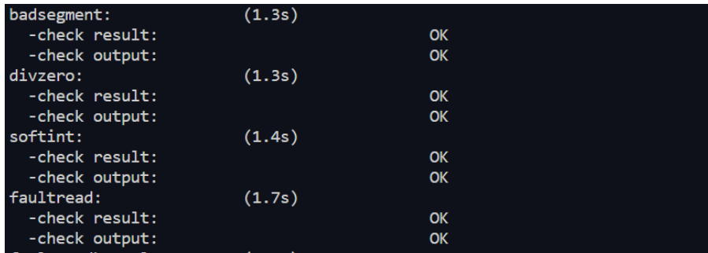
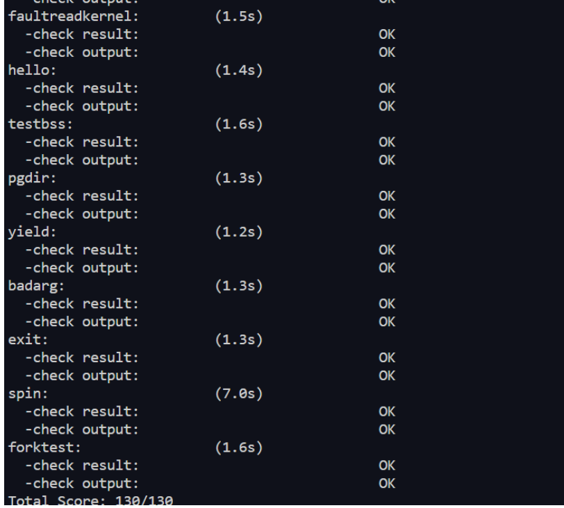
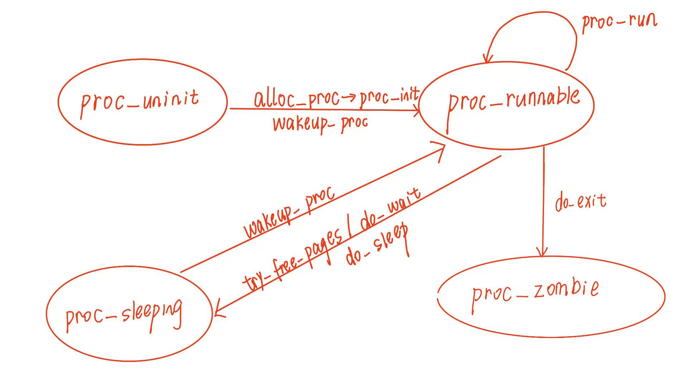

# LAB5实验报告

## 练习 0：填写已有实验

由于Lab5在进程控制块`proc_sturct`中加入了`exit_code`、`wait_state`以及标识线程之间父子关系的链表节点`*cptr`, `*yptr`, `*optr`。

```c
// kern/process/proc.h
int exit_code;   // 退出码，当前线程退出时的原因(在回收子线程时会发送给父线程)
uint32_t wait_state;  // 等待状态
// cptr即child ptr，当前线程子线程(链表结构)
// yptr即younger sibling ptr；
// optr即older sibling ptr;
// cptr为当前线程的子线程双向链表头结点，通过yptr和optr可以找到关联的所有子线程
struct proc_struct *cptr, *yptr, *optr; // 进程之间的关系
```

因此，分配进程控制块的`alloc_proc`函数有所改变：

```c
// 新增的两行
proc->wait_state = 0;  // PCB 新增的条目，初始化进程等待状态
proc->cptr = proc->optr = proc->yptr = NULL; //指针初始化
```

而在`do_fork`函数中，还需要设置进程之间的关系，直接调用`set_links`函数即可。

```c
// do_fork 函数新增
set_links(proc);  // 设置进程链接
```

`set_links`函数将进程加入进程链表，设置进程关系，并将`nr_process`加1。

```c
static void set_links(struct proc_struct *proc) {
    list_add(&proc_list,&(proc->list_link)); // 进程加入进程链表
    proc->yptr = NULL;  // 当前进程的 younger sibling 为空
    if ((proc->optr = proc->parent->cptr) != NULL) {
        proc->optr->yptr = proc;  // 当前进程的 older sibling 为当前进程
    }
    proc->parent->cptr = proc;  // 父进程的子进程为当前进程
    nr_process ++;  //进程数加一
}
```

## 练习 1：加载应用程序并执行（需要编码）

> **do_execv**函数调用`load_icode`（位于kern/process/proc.c中）来加载并解析一个处于内存中的ELF执行文件格式的应用程序。你需要补充`load_icode`的第6步，建立相应的用户内存空间来放置应用程序的代码段、数据段等，且要设置好`proc_struct`结构中的成员变量trapframe中的内容，确保在执行此进程后，能够从应用程序设定的起始执行地址开始执行。需设置正确的trapframe内容。
>
> 请在实验报告中简要说明你的设计实现过程。
>
> - 请简要描述这个用户态进程被ucore选择占用CPU执行（RUNNING态）到具体执行应用程序第一条指令的整个经过。

### （一）设计实现过程

`load_icode`的六步工作内容如下：

- 第一步：为当前进程创建一个新的 `mm` 结构
- 第二步：创建一个新的页目录表（`PDT`），并将` mm->pgdir `设置为页目录表的内核虚拟地址。
- 第三步：构建二进制的 `BSS` 部分到进程的内存空间
- 第四步：构建用户栈内存
- 第五步： 设置当前进程的 `mm`、`sr3`，并设置 `CR3` 寄存器为页目录表的物理地址
- 第六步：为用户环境设置 `trapframe`。框架代码已经保存中断前的`sstatus`寄存器。

在第六步中，我们需要设置 `tf->gpr.sp`， `tf->epc`以及 `tf->status`。

-  `tf->gpr.sp`：用户进程的栈指针。每个用户进程会有两个栈，一个内核栈一个用户栈，在这里我们使用`kern\mm\memlayout.h`中的宏定义`USTACKTOP`即用户栈的顶部赋值给sp寄存器。
-  `tf->epc`：用户程序的入口点。在`ELF`格式中，文件头部的结构体`elfhdr`中有一个字段`e_entry`表示可执行文件的入口点，我们将其赋值给`epc`作为用户程序的入口点。
-  `tf->status`：用户程序中需要修改status寄存器的`SPP`位与`SPIE`位。`SPP`记录的是在中断之前处理器的特权级别，0表示`U-Mode`，1表示`S-Mode`。`SPIE`位记录的是在中断之前中断是否开启，0表示中断开启，1表示中断关闭。我们的目的是让CPU进入`U_mode`执行`do_execve()`加载的用户程序，在返回时要通过`SPP`位回到用户模式，因此需要把`SSTATUS_SPP`置0。默认中断返回后，用户态执行时是开中断的，因此`SPIE`位也要置零。总结来说我们需要把保留的中断前的寄存器`sstatus`中的`SSTATUS_SPP`以及`SSTATUS_SPIE`位清零。

最终我们编写的代码如下：

```C
tf->gpr.sp = USTACKTOP;//设置用户态的栈顶指针  
tf->epc = elf->e_entry;//设置系统调用中断返回后执行的程序入口为elf头中设置的e_entry
tf->status = sstatus & ~(SSTATUS_SPP | SSTATUS_SPIE);//设置sstatus寄存器清零SSTATUS_SPP位和SSTATUS_SPIE位
```

### （二）过程简述

本实验中第一个用户进程是由第二个内核线程`initproc`通过把应用程序执行码覆盖到`initproc`的用户虚拟内存空间来创建的。

（1）`kern\process\proc.c\init_main`中使用`kernel_thread`函数创建了一个子线程`user_main`。内核线程`initproc`在创建完成用户态进程`userproc`后调用了`do_wait`函数，`do_wait`检测到存在`RUNNABLE`的子进程后，调用`schedule`函数。

（2）`schedule`函数从进程链表中选中该`PROC_RUNNABLE`态的进程，调用`proc_run()`函数运行该进程。

（3）进入`user_main`线程后，通过宏`KERNEL_EXECVE`宏定义调用`__KERNEL_EXECVE`函数，从中调用`kernel_execve`函数。首先将系统调用号、函数名称、函数长度、代码地址、代码大小存储在寄存器中。由于目前我们在S mode下，所以不能通过`ecall`来产生中断，只能通过设置`a7`寄存器的值为`10`后用`ebreak`产生断点中断转发到`syscall()`来实现在内核态使用系统调用。之后将存储在`a0`寄存器中的系统调用号作为返回值返回。

（4）当`ucore`收到此系统调用后，首先进入`kern\trap\trapentry.S`中的`_alltraps`保存当前的寄存器状态，然后跳转到`trap`函数中根据发生的陷阱类型进行分发。`trap_dispatch`根据`tf->cause`将处理任务分发给`exception_handler`，之后根据寄存器`a7`的值为`10`调用函数`syscall()`。

（5）在内核态的函数`syscall()`中通过`trapframe`读取寄存器的值，将系统调用号以及其他参数传给函数指针的数组syscalls。

（6）在调用过程中`syscalls=SYS_exec`，因此会调用函数`sys_exec`。函数`sys_exec`对于四个参数进行处理后调用函数`do_execve(name, len, binary, size)`。

（7）`do_execve()`函数中首先替换掉当前线程中的`mm_struct`为加载新的执行码做好用户态内存空间清空准备，之后调用`load_icode()`函数把新的程序加载到当前进程，并设置好进程名字。

（8）回到`exception_handler()`函数中更新内核栈位置，然后回到`__trapret`函数中将寄存器设置为应用进程的相关状态，当`__trapret`执行iret指令时就会跳转到应用程序的入口中，并且特权级也由内核态跳转到用户态，接下来就开始执行用户程序的第一条指令。


## 练习2：父进程复制自己的内存空间给子进程(需要编码)

> 创建子进程的函数`do_fork`在执行中将拷贝当前进程(即父进程)的用户内存地址空间中的合法内容到新进程中(子进程)，完成内存资源的复制。具体是通过`copy_range`函数(位于`kern/mm/pmm.c`中)实现的，请补充`copy_range`的实现，确保能够正确执行。
>
> 请在实验报告中简要说明你的设计实现过程。
>
> - 如何设计实现`Copy on Write`机制？给出概要设计，鼓励给出详细设计。

`Copy on Write`机制见Challenge部分。

在`do_fork`函数中，通过调用`copy_mm`来执行内存空间的复制。在这一过程中，进一步调用了`dup_mmap`函数，该函数的核心操作是遍历父进程的所有合法虚拟内存空间，然后将这些空间的内容复制到子进程的内存空间中。具体而言，这一内存复制的实现是通过`copy_range`函数完成的。

`copy_range`函数的执行流程具体包括遍历父进程指定的某一段内存空间中的每一个虚拟页。在存在虚拟页的情况下，为子进程相同地址申请分配一个物理页，接着将父进程虚拟页中的所有内容复制到新分配的物理页中。随后，建立子进程的这个物理页和对应的虚拟地址之间的映射关系。

练习需要完成的部分是复制页面的内容到子进程需要被填充的物理页`npage`，建立`npage`的物理地址到线性地址`start`的映射。步骤如下：

1. 使用宏`page2kva(page)`  找到父进程需要复制的物理页的内核虚拟地址；
2. 使用宏`page2kva(npage)` 找到子进程需要被填充的物理页的内核虚拟地址；
3. 使用`memcpy(kva_dst, kva_src, PGSIZE)`将父进程的物理页的内容复制到子进程中去；
4. 通过`page_insert(to, npage, start, perm)`建立子进程的物理页与虚拟页的映射关系。

代码如下：

```c
void *kva_src = page2kva(page); 
void *kva_dst = page2kva(npage); 
memcpy(kva_dst, kva_src, PGSIZE); 
ret = page_insert(to, npage, start, perm);
```

完成所有编码后，`make grade`输出截图：





## 练习3: 阅读分析源代码，理解进程执行 fork/exec/wait/exit 的实现，以及系统调用的实现（不需要编码）
>请在实验报告中简要说明你对 fork/exec/wait/exit函数的分析。并回答如下问题：
>
>- 请分析fork/exec/wait/exit的执行流程。重点关注哪些操作是在用户态完成，哪些是在内核态完成？内核态与用户态程序是如何交错执行的？内核态执行结果是如何返回给用户程序的？
>
>- 请给出ucore中一个用户态进程的执行状态生命周期图（包执行状态，执行状态之间的变换关系，以及产生变换的事件或函数调用）。（字符方式画即可）


### 函数分析&执行流程

#### fork函数

>**用户态：fork() -> sys_fork() -> syscall(SYS_fork) -> ecall -> 内核态**
 
 ```c
 int fork(void) {
    return sys_fork();
}
```
```c
int sys_fork(void) {
    return syscall(SYS_fork);
}
```
```c
#define SYS_fork            2
```
---
>**内核态：syscall() -> sys_fork() -> do_fork(0, stack, tf)**
```c
void
syscall(void) {
    struct trapframe *tf = current->tf;
    uint64_t arg[5];
    int num = tf->gpr.a0;
    if (num >= 0 && num < NUM_SYSCALLS) {
        if (syscalls[num] != NULL) {
            arg[0] = tf->gpr.a1;
            arg[1] = tf->gpr.a2;
            arg[2] = tf->gpr.a3;
            arg[3] = tf->gpr.a4;
            arg[4] = tf->gpr.a5;
            tf->gpr.a0 = syscalls[num](arg);
            return ;
        }
    }
    print_trapframe(tf);
    panic("undefined syscall %d, pid = %d, name = %s.\n",
            num, current->pid, current->name);
}
static int (*syscalls[])(uint64_t arg[]) = {
    [SYS_exit]              sys_exit,
    [SYS_fork]              sys_fork,
    [SYS_wait]              sys_wait,
    [SYS_exec]              sys_exec,
    [SYS_yield]             sys_yield,
    [SYS_kill]              sys_kill,
    [SYS_getpid]            sys_getpid,
    [SYS_putc]              sys_putc,
    [SYS_pgdir]             sys_pgdir,
};
```
```c

static int
sys_fork(uint64_t arg[]) {
    struct trapframe *tf = current->tf;
    uintptr_t stack = tf->gpr.sp;
    return do_fork(0, stack, tf);
}
```
```c
int do_fork(uint32_t clone_flags, uintptr_t stack, struct trapframe* tf) {
    int ret = -E_NO_FREE_PROC;
    struct proc_struct* proc;
    if (nr_process >= MAX_PROCESS) {
        goto fork_out;
    }
    ret = -E_NO_MEM;

    if ((proc = alloc_proc()) == NULL)
    {
        goto fork_out;
    }
    proc->parent = current;
    assert(current->wait_state == 0);
    if (setup_kstack(proc) != 0)
    {
        goto bad_fork_cleanup_proc;
    }
    ;
    if (copy_mm(clone_flags, proc) != 0)
    {
        goto bad_fork_cleanup_kstack;
    }
    copy_thread(proc, stack, tf);
    bool intr_flag;
    local_intr_save(intr_flag);
    {
        int pid = get_pid();
        proc->pid = pid;
        hash_proc(proc);
        set_links(proc);
    }
    local_intr_restore(intr_flag);
    wakeup_proc(proc);
    ret = proc->pid;

fork_out:
    return ret;

bad_fork_cleanup_kstack:
    put_kstack(proc);
bad_fork_cleanup_proc:
    kfree(proc);
    goto fork_out;
}
```


---

 >**`fork` 的执行流程**

1. **检查进程数限制**：
   - 检查当前系统是否已达到允许的最大进程数量 (`nr_process >= MAX_PROCESS`)。
   - 如果达到限制，直接跳转到 `fork_out`，返回 `-E_NO_FREE_PROC`，表示进程无法创建。

2. **分配进程控制块（`proc_struct`）**：
   - 调用 `alloc_proc()` 创建并初始化一个新的 `proc_struct`，即为子进程分配内核数据结构。
   - 如果分配失败，跳转到 `fork_out`，返回 `-E_NO_MEM`。

3. **设置父子关系**：
   - 将当前进程（`current`）设为子进程的父进程 (`proc->parent = current`)。
   - 确保父进程的 `wait_state` 状态为 0，表示父进程未阻塞等待子进程结束。

4. **分配内核栈**：
   - 调用 `setup_kstack(proc)` 为子进程分配一个独立的内核栈（kernel stack）。
   - 如果分配失败，跳转到 `bad_fork_cleanup_proc`，释放已分配的 `proc_struct`。

5. **复制内存空间**：
   - 调用 `copy_mm(clone_flags, proc)`，根据 `clone_flags` 来共享（`CLONE_VM`）或复制（独立地址空间）父进程的内存描述符（`mm_struct`）。
   - 如果失败，跳转到 `bad_fork_cleanup_kstack`，释放内核栈。

6. **设置子进程上下文（Trapframe 和 Kernel Context）**：
   - 调用 `copy_thread(proc, stack, tf)`，将父进程的用户态寄存器上下文 (`trapframe`) 复制到子进程中，并设置内核态的入口和内核栈。

7. **分配进程 ID 并插入调度结构**：
   - 分配唯一的进程 ID (`pid = get_pid()`)，并将子进程插入进程哈希表（`hash_proc(proc)`）和链表（`proc_list`）。
   - 调用 `set_links(proc)` 建立父子关系和进程链表关系。

8. **唤醒子进程**：
   - 设置子进程状态为 `PROC_RUNNABLE`，使其可以被调度执行。
   - 最终将子进程的 `pid` 赋值给 `ret`，作为返回值。

9. **错误处理**：
   - 在内存分配失败的情况下，执行相应的清理代码，释放已经分配的资源（例如内核栈或 `proc_struct`）。

10. **返回结果**：
    - 成功时返回子进程的 `pid`。
    - 失败时返回相应的错误码（如 `-E_NO_FREE_PROC` 或 `-E_NO_MEM`）。

---

 >**内核态如何返回到用户程序？**

1. **子进程的内核态返回**：
   - 子进程创建完成后，其 `trapframe` 已经设置，包括程序计数器（`EIP` 或 `PC`）和栈指针（`ESP` 或 `SP`）等寄存器的用户态上下文。
   - 调用 `copy_thread` 时，子进程的返回值被设置为 0，这是 `fork` 系统调用在子进程中的返回值。

2. **父进程的内核态返回**：
   - 父进程调用 `do_fork` 并成功返回后，返回值是子进程的 `pid`。

3. **进程切换和返回用户态**：
   - 当内核完成 `do_fork` 后，内核通过调度程序（scheduler）决定是继续执行父进程还是切换到子进程。
   - 子进程第一次运行时，内核会加载 `trapframe`，并通过系统调用的返回路径返回用户态。

4. **`fork` 系统调用的用户态表现**：
   - 在用户态，`fork` 系统调用的返回值区分父子进程：
     - 父进程收到的返回值是子进程的 `pid`。
     - 子进程收到的返回值是 0。

---
#### exec函数

>**内核态：kernel_execve() -> ebreak -> syscall() -> sys_exec() -> do_execve()**

```c
static int kernel_execve(const char *name, unsigned char *binary, size_t size) {
    int64_t ret=0, len = strlen(name);
 //   ret = do_execve(name, len, binary, size);
    asm volatile(
        "li a0, %1\n"
        "lw a1, %2\n"
        "lw a2, %3\n"
        "lw a3, %4\n"
        "lw a4, %5\n"
    	"li a7, 10\n"
        "ebreak\n"
        "sw a0, %0\n"
        : "=m"(ret)
        : "i"(SYS_exec), "m"(name), "m"(len), "m"(binary), "m"(size)
        : "memory");
    cprintf("ret = %d\n", ret);
    return ret;
}
```
```c
static int sys_exec(uint64_t arg[]) {
    const char *name = (const char *)arg[0];
    size_t len = (size_t)arg[1];
    unsigned char *binary = (unsigned char *)arg[2];
    size_t size = (size_t)arg[3];
    return do_execve(name, len, binary, size);
}
```

```c
int
do_execve(const char *name, size_t len, unsigned char *binary, size_t size) {
    struct mm_struct *mm = current->mm;
    if (!user_mem_check(mm, (uintptr_t)name, len, 0)) {
        return -E_INVAL;
    }
    if (len > PROC_NAME_LEN) {
        len = PROC_NAME_LEN;
    }

    char local_name[PROC_NAME_LEN + 1];
    memset(local_name, 0, sizeof(local_name));
    memcpy(local_name, name, len);

    if (mm != NULL) {
        cputs("mm != NULL");
        lcr3(boot_cr3);
        if (mm_count_dec(mm) == 0) {
            exit_mmap(mm);
            put_pgdir(mm);
            mm_destroy(mm);
        }
        current->mm = NULL;
    }
    int ret;
    if ((ret = load_icode(binary, size)) != 0) {
        goto execve_exit;
    }
    set_proc_name(current, local_name);
    return 0;

execve_exit:
    do_exit(ret);
    panic("already exit: %e.\n", ret);
}
```

---

> **`exec` 的执行流程**

1. **检查参数有效性**：
   - 使用 `user_mem_check` 确保 `name` 是用户地址空间的合法内存区域，长度为 `len`，并且可以访问。
   - 如果检查失败，返回 `-E_INVAL`。

2. **截断和复制进程名称**：
   - 如果程序名称的长度超过最大允许值（`PROC_NAME_LEN`），截断到允许的最大长度。
   - 将程序名称从用户空间复制到内核栈上的局部缓冲区 `local_name`，以确保安全操作。

3. **释放当前进程的地址空间**：
   - 如果当前进程的内存管理结构（`mm_struct`）不为空，执行以下操作：
     - 使用 `lcr3(boot_cr3)` 切换到内核的页目录表（`boot_cr3`），以避免操作当前进程的页表时发生错误。
     - 调用 `mm_count_dec` 减少 `mm_struct` 的引用计数：
       - 如果引用计数降为 0，调用 `exit_mmap` 释放地址空间中的内存映射区域，调用 `put_pgdir` 释放页目录表，最后调用 `mm_destroy` 销毁整个 `mm_struct`。
     - 将当前进程的 `mm` 设置为 `NULL`。

4. **加载新程序**：
   - 调用 `load_icode(binary, size)` 将新的程序加载到内存中。
   - 如果加载失败（返回非零值），跳转到 `execve_exit`，退出函数。

5. **设置进程名称**：
   - 调用 `set_proc_name` 将当前进程的名称设置为新加载的程序的名称。

---
#### wait函数

>**用户态：wait() -> sys_wait() -> syscall(SYS_wait) -> ecall -> 内核态**

```c
int wait(void) {
    return sys_wait(0, NULL);
}
```
```c
int sys_wait(int64_t pid, int *store) {
    return syscall(SYS_wait, pid, store);
}
```
```c
#define SYS_wait            3
```
---
>**内核态：syscall() -> sys_wait() -> do_wait()**

```c
static int sys_wait(uint64_t arg[]) {
    int pid = (int)arg[0];
    int *store = (int *)arg[1];
    return do_wait(pid, store);
}
```
```c
int do_wait(int pid, int *code_store) {
    struct mm_struct *mm = current->mm;
    if (code_store != NULL) {
        if (!user_mem_check(mm, (uintptr_t)code_store, sizeof(int), 1)) {
            return -E_INVAL;
        }
    }

    struct proc_struct *proc;
    bool intr_flag, haskid;
repeat:
    haskid = 0;
    if (pid != 0) {
        proc = find_proc(pid);
        if (proc != NULL && proc->parent == current) {
            haskid = 1;
            if (proc->state == PROC_ZOMBIE) {
                goto found;
            }
        }
    }
    else {
        proc = current->cptr;
        for (; proc != NULL; proc = proc->optr) {
            haskid = 1;
            if (proc->state == PROC_ZOMBIE) {
                goto found;
            }
        }
    }
    if (haskid) {
        current->state = PROC_SLEEPING;
        current->wait_state = WT_CHILD;
        schedule();
        if (current->flags & PF_EXITING) {
            do_exit(-E_KILLED);
        }
        goto repeat;
    }
    return -E_BAD_PROC;

found:
    if (proc == idleproc || proc == initproc) {
        panic("wait idleproc or initproc.\n");
    }
    if (code_store != NULL) {
        *code_store = proc->exit_code;
    }
    local_intr_save(intr_flag);
    {
        unhash_proc(proc);
        remove_links(proc);
    }
    local_intr_restore(intr_flag);
    put_kstack(proc);
    kfree(proc);
    return 0;
}
```


---

> **`wait` 的执行流程**

1. **检查用户内存空间合法性**：
   - 如果 `code_store` 不为空，检查它是否是合法的用户空间地址，并具有写权限。
   - 如果检查失败，返回 `-E_INVAL` 表示无效参数。

2. **初始化变量**：
   - 设置 `haskid` 为 `0`，用于标识当前进程是否存在子进程。
   - 根据 `pid` 的值分两种情况处理：
     - **特定子进程**：查找指定的子进程。
     - **任意子进程**：遍历当前进程的所有子进程。

3. **查找目标子进程**：
   - **特定子进程**：
     - 调用 `find_proc(pid)` 查找进程控制块。
     - 确认子进程的父进程是否是当前进程（`proc->parent == current`）。
     - 如果该子进程的状态是 `PROC_ZOMBIE`（僵尸进程），跳转到 `found` 标签处理。
   - **任意子进程**：
     - 遍历当前进程的子进程链表，从 `current->cptr`（第一个子进程）开始，检查每个子进程的状态。
     - 如果找到僵尸进程，跳转到 `found` 标签处理。

4. **进入等待状态**：
   - 如果没有找到符合条件的子进程，但当前进程存在子进程（`haskid == 1`），则进入等待：
     - 将当前进程状态设置为 `PROC_SLEEPING`（睡眠态）。
     - 设置等待状态为 `WT_CHILD`，表示当前进程在等待子进程结束。
     - 调用 `schedule()` 让出 CPU。
   - 当被唤醒后，检查是否收到杀死信号（`current->flags & PF_EXITING`），如果是，则调用 `do_exit(-E_KILLED)` 退出。
   - 跳转到 `repeat` 重新开始查找子进程。

5. **清理子进程资源**（`found` 标签）：
   - 检查目标子进程是否是 `idleproc` 或 `initproc`，如果是，触发内核错误（`panic`）。
   - 如果 `code_store` 不为空，将子进程的退出码（`proc->exit_code`）写入到用户空间的 `code_store`。

6. **释放子进程资源**：
   - 禁止中断，调用以下函数清理资源：
     - `unhash_proc(proc)`：从进程哈希表中移除该子进程。
     - `remove_links(proc)`：从父子进程链表中移除该子进程。
   - 恢复中断。
   - 调用 `put_kstack(proc)` 释放子进程的内核栈。
   - 调用 `kfree(proc)` 释放子进程的内核数据结构。

7. **返回成功状态**：
   - 返回值为 0，表示成功等待到子进程并完成资源回收。

---

> **内核态如何返回到用户程序**

1. **进入内核态**：
   - 用户进程通过系统调用进入内核态，内核中调用 `do_wait` 函数处理。

2. **处理中断和睡眠**：
   - 如果父进程需要等待子进程，`do_wait` 会将父进程设置为 `PROC_SLEEPING`，调用 `schedule` 让出 CPU。
   - 当子进程状态改变（如退出并变为 `PROC_ZOMBIE`），内核会唤醒父进程，重新执行 `do_wait` 的逻辑。

3. **完成清理后返回用户态**：
   - 成功：`do_wait` 返回 0，表示等待完成，用户态 `wait` 系统调用返回值为成功状态。
   - 失败：返回负值错误码（如 `-E_BAD_PROC`），表示未找到子进程，用户态 `wait` 系统调用会返回相应的错误。

4. **用户态表现**：
   - 成功时，用户程序的 `waitpid` 会返回子进程的 PID 或成功状态。
   - 如果有指定的 `code_store`，则子进程的退出码会被写入到用户程序的指定位置。

---

#### exit函数

>**用户态：exit() -> sys_exit() -> syscall(SYS_exit) -> ecall -> 内核态**

```c
void exit(int error_code) {
    sys_exit(error_code);
    cprintf("BUG: exit failed.\n");
    while (1);
}
```

```c
int sys_exit(int64_t error_code) {
    return syscall(SYS_exit, error_code);
}
```

```c
#define SYS_exit            1
```

---
>**内核态：syscall() -> sys_exit() -> do_exit()**
```c
static int sys_exit(uint64_t arg[]) {
    int error_code = (int)arg[0];
    return do_exit(error_code);
}

```
```c
int do_exit(int error_code) {
    if (current == idleproc) {
        panic("idleproc exit.\n");
    }
    if (current == initproc) {
        panic("initproc exit.\n");
    }
    struct mm_struct *mm = current->mm;
    if (mm != NULL) {
        lcr3(boot_cr3);
        if (mm_count_dec(mm) == 0) {
            exit_mmap(mm);
            put_pgdir(mm);
            mm_destroy(mm);
        }
        current->mm = NULL;
    }
    current->state = PROC_ZOMBIE;
    current->exit_code = error_code;
    bool intr_flag;
    struct proc_struct *proc;
    local_intr_save(intr_flag);
    {
        proc = current->parent;
        if (proc->wait_state == WT_CHILD) {
            wakeup_proc(proc);
        }
        while (current->cptr != NULL) {
            proc = current->cptr;
            current->cptr = proc->optr;
    
            proc->yptr = NULL;
            if ((proc->optr = initproc->cptr) != NULL) {
                initproc->cptr->yptr = proc;
            }
            proc->parent = initproc;
            initproc->cptr = proc;
            if (proc->state == PROC_ZOMBIE) {
                if (initproc->wait_state == WT_CHILD) {
                    wakeup_proc(initproc);
                }
            }
        }
    }
    local_intr_restore(intr_flag);
    schedule();
    panic("do_exit will not return!! %d.\n", current->pid);
}
```


---

>**`do_exit` 的执行流程**

1. **禁止关键进程退出**：
   - 检查当前进程是否是 `idleproc`（空闲进程）或 `initproc`（初始进程），这两类进程不允许退出。
   - 如果尝试退出，触发内核恐慌（`panic`）。

2. **释放当前进程的内存资源**：
   - 如果当前进程的内存管理结构（`mm`）不为空：
     - 切换页表到 `boot_cr3`（内核页表）。
     - 调用以下函数释放进程的内存资源：
       - `exit_mmap(mm)`：释放进程的所有虚拟内存区域。
       - `put_pgdir(mm)`：释放页目录表。
       - `mm_destroy(mm)`：销毁内存管理结构。
     - 将 `current->mm` 设置为 `NULL`，表示该进程不再关联任何内存。

3. **设置进程状态为僵尸态**：
   - 将当前进程的状态设置为 `PROC_ZOMBIE`。
   - 保存退出码 `error_code` 到 `current->exit_code`，供父进程回收时使用。

4. **通知父进程**：
   - 保护关键区，禁止中断。
   - 获取当前进程的父进程指针 `current->parent`：
     - 如果父进程的等待状态是 `WT_CHILD`，调用 `wakeup_proc(proc)` 唤醒父进程，让其处理子进程的退出。

5. **重新分配子进程**：
   - 如果当前进程有子进程，将其所有子进程重新分配给 `initproc`：
     - 遍历当前进程的子进程链表。
     - 将每个子进程的父进程指针（`proc->parent`）修改为 `initproc`。
     - 调整子进程链表中的前后指针以完成迁移。
     - 如果某个子进程已经是僵尸态，并且 `initproc` 处于 `WT_CHILD` 状态，则唤醒 `initproc` 以处理这些子进程。

6. **调度器切换到其他进程**：
   - 恢复中断。
   - 调用 `schedule()` 切换到其他进程。
   - **注意**：由于当前进程状态已被设置为僵尸态，它将不再被调度执行。

7. **永不返回**：
   - 在退出逻辑的最后调用 `panic` 以防止程序返回，因为理论上 `do_exit` 不会返回到调用者。

---

> **内核态如何完成退出并返回给用户程序**

1. **从用户态进入内核态**：
   - 用户进程调用 `exit` 系统调用。
   - 内核进入 `do_exit` 函数处理退出逻辑。

2. **切换到僵尸态**：
   - 内核将进程状态设置为 `PROC_ZOMBIE`，并释放大部分资源（如内存、内核栈）。

3. **通知父进程**：
   - 唤醒父进程，让其通过 `wait` 系统调用回收子进程的资源。
   - 父进程通过 `wait` 获取子进程的退出码和状态。

4. **切换到其他进程**：
   - 调用 `schedule` 将 CPU 控制权交给其他可运行的进程。
   - 当前进程进入僵尸态后，直到被父进程回收才会被完全清除。

5. **退出的结果传递**：
   - 对于用户程序：
     - `exit` 系统调用通常不返回，表示进程退出。
     - 父进程可以通过 `wait` 或 `waitpid` 获取退出结果。

6. **僵尸态清理**：
   - 子进程的状态和退出码保存在其进程控制块中，直到父进程回收。
   - 只有在父进程调用 `wait` 回收子进程后，子进程的所有资源才会完全释放。

---

>**内核到用户程序的交互**

- 内核中 `do_exit` 负责进程退出及资源释放，退出后不直接返回用户态。
- 父进程通过 `wait` 获取子进程的退出码并完成回收。
- 整个过程由调度器 `schedule` 管理，确保 CPU 资源分配给其他进程。


### ucore中一个用户态进程的执行状态生命周期图




## 扩展练习 Challenge1

> 实现 Copy on Write （COW）机制
>
> 给出实现源码，测试用例和设计报告（包括在cow情况下的各种状态转换（类似有限状态自动机）的说明）。
>
> 这个扩展练习涉及到本实验和上一个实验“虚拟内存管理”。请在ucore中实现这样的COW机制。
>
> 由于COW实现比较复杂，容易引入bug，请参考 https://dirtycow.ninja/ 看看能否在ucore的COW实现中模拟这个错误和解决方案。需要有解释。

COW基本机制为：在ucore操作系统中，当一个用户父进程创建自己的子进程时，父进程会把其申请的用户空间设置为只读，子进程可共享父进程占用的用户内存空间中的页面（这就是一个共享的资源）。当其中任何一个进程修改此用户内存空间中的某页面时，ucore会通过page fault异常获知该操作，并完成拷贝内存页面，使得两个进程都有各自的内存页面。这样一个进程所做的修改不会被另外一个进程可见了。

在`do_fork`函数中，内存复制通过调用`copy_mm`函数、进而调用`do_range`函数实现。`do_range`函数根据传入的参数`share`决定是否进行内存复制或共享。

如果`share`为0，则完整拷贝内存，与之前代码一致；如果`share`为1，则使用COW机制，进行物理页面共享，在两个进程页目录表中加入共享页面的映射关系，并设置只读。

```c
page_insert(from, page, start, perm & ~PTE_W);
ret = page_insert(to, page, start, perm & ~PTE_W);
```

当其中任何一个进程修改此用户内存空间中的某页面时，由于PTE上的`PTE_W`为0，所以会触发缺页异常。此时需要通过`page fault`异常获知该操作，并完成拷贝内存页面，使得两个进程都有各自的内存页面。

在`do_pgfault`函数内，会尝试获取这个地址对应的页表项，如果页表项不为空，且页表项有效，这说明缺页异常是因为试图在只读页面中写入而引起的。

在这种情况下，如果试图写入的只读页面只被一个进程使用，重设权限`PTE_W`为1并插入映射即可；

而如果被多个进程使用，需要调用`pgdir_alloc_page`函数，在该函数内分配页面并设置新地址映射。之后，将数据拷贝到新分配的页中，并将其加入全局虚拟内存交换管理器的管理。

```c
if (*ptep & PTE_V)
{
    cprintf("\n\nCOW: ptep 0x%x, pte 0x%x\n", ptep, *ptep);
    // 只读物理页
    page = pte2page(*ptep);
    // 如果该物理页面被多个进程引用
    if (page_ref(page) > 1)
    {
        // 分配页面并设置新地址映射
        // pgdir_alloc_page -> alloc_page()  page_insert()
        struct Page *newPage = pgdir_alloc_page(mm->pgdir, addr, perm);
        void *kva_src = page2kva(page);
        void *kva_dst = page2kva(newPage);
        // 拷贝数据
        memcpy(kva_dst, kva_src, PGSIZE);
    }
    // 如果该物理页面只被当前进程所引用
    else
    { 
        // page_insert，保留当前物理页，重设其PTE权限
        page_insert(mm->pgdir, page, addr, perm);
    }
}
else
{
    // Lab 3 中的代码
    // 页面被交换到了磁盘中
    // 将线性地址对应的物理页数据从磁盘交换到物理内存
}
swap_map_swappable(mm, addr, page, 1);
page->pra_vaddr = addr;
```

`make qemu`输出如下，验证了COW的正确性。


### COW机制状态转换

1. **共享状态 (Shared State)**  
   这是对象或内存页的初始状态。多个进程或线程共享同一份数据，并且该数据是只读的。此时，数据的所有者并没有进行修改。  
   - 状态：**Shared**
   - 特征：多个读者可以同时访问此数据。

2. **被请求修改状态 (Requested for Modification)**  
   当某个进程或线程需要修改该共享数据时，数据仍然是共享状态，但该进程或线程已经请求了对数据的修改。  
   - 状态：**Requested for Modification**
   - 特征：该进程或线程正在尝试修改数据，其他进程继续可以读。

3. **复制状态 (Copying/Copy)**
   当一个进程决定修改共享数据时，它首先会复制一份该数据，然后在自己的副本上进行修改。这时，数据会从共享状态转换为该进程独享副本的状态。  
   - 状态：**Copy**
   - 特征：该进程获得了数据的独立副本，并可以修改副本，其他进程仍然访问共享的原数据。

4. **独占修改状态 (Exclusive Modification)**  
   一旦数据副本被修改完毕，进程便开始在独占的修改状态下工作，数据的副本已经不再共享，其他进程无法继续修改原数据。  
   - 状态：**Exclusive**
   - 特征：该进程拥有该数据的独占访问权限，并且其他进程不能修改该副本的数据。

5. **释放/共享回归状态 (Released/Back to Shared)**  
   修改完成后，某些情况下该数据副本可以被释放，或者经过其他进程的重新共享，使得数据恢复为共享状态。这取决于实现，可能会将修改的数据复制到原始共享区域，或者新副本保持在修改状态直到完全释放。  
   - 状态：**Released or Back to Shared**
   - 特征：数据可能重新回到共享状态，允许其他进程继续共享和访问。

### 状态转换过程

1. **初始化状态：**  
   - 所有进程都进入共享状态，数据可读且只读。

2. **第一次修改请求：**  
   - 进程发起修改请求时，进入“请求修改”状态，但数据仍处于共享状态。

3. **数据复制：**  
   - 当进程决定修改数据时，会触发数据的复制动作，进入复制状态。进程获得该数据的独立副本，进入独占状态。

4. **独占修改：**  
   - 修改完成后，数据进入独占修改状态，进程拥有该数据的独立副本并对其进行修改。

5. **数据释放/共享回归：**  
   - 如果修改完成并且数据不再需要被独占，数据可能会恢复到共享状态，允许其他进程访问。

### 状态转换的简要表

| 当前状态               | 操作                         | 下一状态           | 描述                             |
|------------------------|------------------------------|--------------------|----------------------------------|
| **Shared**             | 请求修改                     | Requested for Modification | 进程请求修改数据，数据仍共享。        |
| **Requested for Modification** | 复制数据                  | Copy               | 数据被复制，进入独占状态。            |
| **Copy**               | 完成修改                     | Exclusive          | 数据被修改，进入独占状态。            |
| **Exclusive**          | 修改完成                     | Released / Shared  | 修改完成，数据可以被共享或释放。    |


通过 COW 机制，可以显著提高内存和资源利用率，减少不必要的复制操作，从而提升系统性能。


### CVE-2016-5195 (Dirty COW) Linux本地提权漏洞

该漏洞是Linux中`get_user_page`内核函数在处理`Copy-on-Write`的过程中，可能产出竞态条件造成COW过程被破坏，导致出现写数据到进程地址空间内只读内存区域的机会。

结合Linux源码分析漏洞产生的原因。

当用`mmap`去映射文件到内存区域时使用了`MAP_PRIVATE`标记，写文件时会写到COW机制产生的内存区域中，原文件不受影响。其中获取用户进程内存页的过程如下：

1. 第一次调用`follow_page_mask`查找虚拟地址对应的page，带有`FOLL_WRITE`标记。因为所在page不在内存中，`follow_page_mask`返回NULL，第一次失败；进入`faultin_page`，最终进入`do_cow_fault`分配不带`_PAGE_RW`标记的匿名内存页，返回值为0。
2. 重新开始循环，第二次调用`follow_page_mask`，带有`FOLL_WRITE`标记。由于不满足`((flags & FOLL_WRITE) && !pte_write(pte))`条件，`follow_page_mask`返回NULL，第二次失败，进入`faultin_page`，最终进入`do_wp_page`函数分配COW页。并在上级函数`faultin_page`中去掉`FOLL_WRITE`标记，返回0。
3. 重新开始循环，第三次调用`follow_page_mask`，不带`FOLL_WRITE`标记。成功得到page。

`__get_user_pages`函数中每次查找page前会先调用`cond_resched()`线程调度一下，这样就引入了竞态条件的可能性。在第二次分配COW页成功后，`FOLL_WRITE`标记已经去掉，如果此时，另一个线程把page释放了，那么第三次由于page不在内存中，又会进行调页处理，由于不带`FOLL_WRITE`标记，不会进行COW操作，而会直接返回之前的**只读物理页**的地址，之后该**只读**页被添加到page数组，并在接下来的操作中被**成功修改**。

## 扩展练习 Challenge2
>说明该用户程序是何时被预先加载到内存中的？与我们常用操作系统的加载有何区别，原因是什么？


### **该用户程序的加载方式**


1. **用户程序的编译和链接**：
   - 用户程序在编译时会被链接到内核映像中，通常是通过在编译时静态链接的方式，这样用户程序就成了内核的一部分。
   - 编译时，用户程序的起始位置和大小已经在内核中定义，程序不会存在于外部存储设备上，而是直接包含在内核映像中。

2. **内核加载程序**：
   - 在 `user_main()` 函数中，调用 `KERNEL_EXECVE` 宏，并进一步调用 `kernel_execve()` 函数。
   - `kernel_execve()` 函数调用 `load_icode()` 函数将已经在内核映像中的用户程序加载到内存中的合适位置。
   - 这种方式通过内核进程直接将用户程序从内核空间加载到内存中，而不依赖于外部存储设备。

3. **执行用户程序**：
   - 加载完成后，内核会为用户程序创建进程结构体，设置相关上下文，并通过调度器将控制权交给用户程序开始执行。

---

### **与常用操作系统的区别**

| **特性**                | **该用户程序**                                      | **常用操作系统**                                 |
|-------------------------|-----------------------------------------------|-----------------------------------------------|
| **加载时机**            | 用户程序在编译时就与内核链接，内核初始化时加载到内存。  | 用户程序通常存储在磁盘等外部存储介质上，按需加载。 |
| **加载机制**            | 用户程序是内核映像的一部分，直接通过内核加载到内存。     | 用户程序在运行时从磁盘或其他存储介质加载到内存。 |
| **文件系统支持**        | 没有实现硬盘和文件系统，用户程序和内核共享内存。   | 常用操作系统实现了文件系统，可以访问磁盘并动态加载程序。 |
| **动态链接和加载**      | 无动态链接机制，用户程序已链接到内核映像中。             | 支持动态链接库和按需加载机制，程序可以动态链接和加载。 |

---

### **原因**

1.  uCore 并没有实现硬盘驱动、文件系统、虚拟内存等复杂功能。因此，用户程序和内核程序被静态地链接在一起，并在内核初始化时直接加载到内存中。这大大简化了内核的实现，避免了需要处理外部存储设备和文件系统的复杂性。

2. 在常用操作系统中，用户程序需要存储在外部存储设备上，并通过文件系统动态加载。这不仅涉及复杂的存储管理，还要求内核支持硬盘驱动、文件系统操作、磁盘调度等多个组件。uCore 将所有这些复杂的功能简化为一个固定的程序加载机制，这样可以减少对硬件的依赖。

3. uCore 没有实现硬盘和文件系统功能，用户程序无法从磁盘加载，因此将程序编译到内核中就成了唯一可行的方式。这样，在 uCore 的环境下，所有程序都可以在内存中运行，而不需要外部存储设备的支持。


